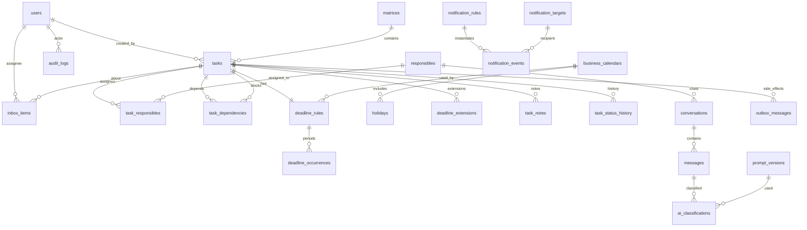

# 02 — Modelo de domínio e banco de dados

**Projeto:** Matriz de Responsabilidade  
**Fase:** 0 (especificação)  
**Idioma do schema:** inglês (`snake_case`)  
**Idioma da UI:** português do Brasil  
**Banco:** PostgreSQL  
**ORM previsto:** Drizzle ORM + migrations versionadas  
**PKs:** `uuid` (preferência: UUIDv7 na implementação)  
**Timestamps:** `timestamptz`  
**Fonte de verdade:** banco de dados, nunca a IA, nunca o Word.

Este documento descreve o **modelo conceitual**. Trechos SQL/Drizzle são ilustrativos. Não são migrations de produção.

Assumptions referenciadas: A1–A36 do brief compartilhado. Assumptions locais deste documento: D1–D8.

---

## 1. Princípios de modelagem

1. **Não duplicar demanda.** A visão “Geral” é consulta (A17). Não existe tabela `general_tasks`.
2. **Não inferir dependência por `sequence_number`.** Dependência existe só em `task_dependencies` (A12).
3. **Não persistir “Atrasado” como status operacional.** Status de prazo é calculado (A13).
4. **Não guardar regra de prazo só como texto.** `deadline_rules` é estruturada.
5. **Não clonar tarefa por mês.** Recorrência = uma `tasks` + N `deadline_occurrences` (A16).
6. **IA não grava estado de domínio.** Classificação, inbox e sugestão apenas (A15).
7. **Evento ≠ efeito colateral.** Outbox transacional para WhatsApp/alertas (A23).
8. **Minimizar tabelas.** Cada extra abaixo tem justificativa; candidatos rejeitados estão na §4.

---

## 2. Diagrama de relacionamentos (conceitual)



---

## 3. Catálogo de entidades

Convenções de colunas:

| Símbolo | Significado |
|---|---|
| PK | chave primária |
| FK | chave estrangeira |
| UQ | único |
| NN | `NOT NULL` |
| — | nullable |

Soft-delete: preferir `archived_at` / `cancelled_at` / `active` a `DELETE` físico, salvo tabelas técnicas (outbox já processada pode ser retida para auditoria).

---

### 3.1 `users`

Operadores da aplicação (login). Não confundir com `responsibles` (pessoas cobradas nas matrizes). Um `user` **pode** também ser um `responsible` (vínculo opcional); no MVP o vínculo não é obrigatório (A9, Q1).

| Campo | Tipo | Nulo | Unicidade | Notas |
|---|---|---|---|---|
| `id` | uuid | NN | PK | |
| `name` | text | NN | | |
| `email` | citext | NN | UQ | login |
| `password_hash` | text | NN | | nunca logar |
| `role` | text | NN | | `ADMIN` \| `OPERATOR` (A9). Check constraint, não ENUM rígido de negócio amplo |
| `active` | boolean | NN | | default true |
| `responsible_id` | uuid | — | UQ se preenchido | FK `responsibles.id`. Ligação opcional |
| `created_at` | timestamptz | NN | | |
| `updated_at` | timestamptz | NN | | |
| `last_login_at` | timestamptz | — | | |

**Índices:** `email` (único); `(active, role)`.

**Dado pessoal:** nome, e-mail, hash de senha, last_login.

---

### 3.2 `responsibles`

Pessoa/papel reutilizável entre matrizes. Papel (`role`) é texto livre com sugestões (A19), não enum.

| Campo | Tipo | Nulo | Unicidade | Notas |
|---|---|---|---|---|
| `id` | uuid | NN | PK | |
| `name` | text | NN | | |
| `role` | text | — | | “Professor”, “Marketing”, etc. |
| `whatsapp_number` | text | — | | exibição humana |
| `whatsapp_number_e164` | text | — | UQ parcial (`WHERE NOT NULL`) | E.164. Necessário para envio |
| `email` | citext | — | | opcional |
| `active` | boolean | NN | | default true |
| `whatsapp_opt_in_status` | text | NN | | `UNKNOWN` \| `OPTED_IN` \| `OPTED_OUT` \| `PENDING` |
| `whatsapp_opt_in_at` | timestamptz | — | | |
| `notes` | text | — | | notas internas do admin, não do responsável |
| `created_at` | timestamptz | NN | | |
| `updated_at` | timestamptz | NN | | |

**Índices:** `whatsapp_number_e164` único parcial; `(active, name)`.

**Dado pessoal:** nome, telefone, e-mail, opt-in, notes se identificarem a pessoa.

**Não** colocar `responsible_id` em `tasks`. Relação N:N em `task_responsibles` (A20).

---

### 3.3 `matrices`

| Campo | Tipo | Nulo | Unicidade | Notas |
|---|---|---|---|---|
| `id` | uuid | NN | PK | |
| `name` | text | NN | | não único globalmente (podem existir homônimos históricos) |
| `description` | text | — | | |
| `type` | text | NN | | string controlada: `GENERAL` \| `PROJECT` \| `COURSE` \| `PRODUCT` \| `EVENT` \| `OTHER`. Novos tipos via `system_settings.allowed_matrix_types` **sem** ENUM de banco (A18) |
| `created_by` | uuid | NN | | FK `users.id` |
| `created_at` | timestamptz | NN | | |
| `updated_at` | timestamptz | NN | | |
| `archived_at` | timestamptz | — | | fonte de verdade de arquivo (A10) |

**Campo derivado (não persistir):** `active = (archived_at IS NULL)`.

**Colisão de vocabulário (I7 / A18):** tipo `GENERAL` (Matriz Geral, um registro) ≠ visão de UI “Geral” (query de todas as demandas).

**Índices:** `(archived_at, name)`; `type`.

**Dado pessoal:** não, salvo se `description` citar pessoas.

---

### 3.4 `tasks`

Unidade de demanda. Uma linha na tabela da matriz.

| Campo | Tipo | Nulo | Unicidade | Notas |
|---|---|---|---|---|
| `id` | uuid | NN | PK | |
| `matrix_id` | uuid | NN | | FK `matrices.id` ON DELETE RESTRICT |
| `sequence_number` | integer | NN | UQ `(matrix_id, sequence_number)` | ordem de **cadastro**, imutável (A11). Não é prioridade. Não gera dependência |
| `display_order` | integer | NN | | editável depois; default = `sequence_number` no insert. Audit obrigatório na mudança (A11) |
| `title` | text | NN | | |
| `description` | text | — | | |
| `base_status` | text | NN | | máquina operacional. Ver `03-state-machines.md` |
| `extension_status` | text | NN | | máquina de prorrogação. Default `NONE` |
| `original_due_date` | date | — | | **primeira** data materializada. Nunca sobrescrita depois (A28). Ver §8 |
| `current_due_date` | date | — | | **prazo vigente**. Atualizado só pelos eventos da §8 |
| `extension_count` | integer | NN | | default 0; incrementa só em `ExtensionApproved` |
| `completed_at` | timestamptz | — | | preenchido só em `COMPLETED` validado. Recorrência: ver D2 |
| `cancelled_at` | timestamptz | — | | |
| `created_by` | uuid | NN | | FK `users.id` |
| `created_at` | timestamptz | NN | | âncora de `BUSINESS_DAYS_AFTER_CREATION` |
| `updated_at` | timestamptz | NN | | |
| `cached_deadline_status` | text | — | | cache da máquina de prazo. **Nunca** fonte de verdade (A13) |
| `deadline_status_computed_at` | timestamptz | — | | |
| `deadline_status_as_of` | date | — | | data civil usada no último cálculo (timezone da regra) |

**Índices relevantes:**

- `UNIQUE (matrix_id, sequence_number)` — cadastro incremental por matriz
- `(matrix_id, display_order)` — render da tabela
- `(base_status)` — dashboard
- `(current_due_date) WHERE cancelled_at IS NULL AND completed_at IS NULL` — vencem hoje / overdue
- `(extension_status) WHERE extension_status = 'REQUESTED'`
- `(matrix_id, base_status)`

**Constraints:** `sequence_number > 0`; `extension_count >= 0`; `base_status` e `extension_status` com CHECK das máquinas.

**Dado pessoal:** título/descrição podem citar nomes; `created_by` identifica operador.

**D2 (recorrência e `completed_at`):** em tarefa `RECURRING_BUSINESS_DAY`, validar entrega **fecha a ocorrência**, não a série. `tasks.completed_at` permanece `NULL` enquanto a série estiver ativa. `base_status` volta a `PENDING` (A16, Q3). Encerrar a série: `CANCELLED` ou `deadline_rules.recurrence_ended_at`.

---

### 3.5 `task_responsibles` (N:N)

Uma tarefa tem **um ou mais** responsáveis. Sem “responsável primário” no MVP (A20). Caso E (Giovanni + Francisco) = duas linhas, uma `tasks`.

| Campo | Tipo | Nulo | Unicidade | Notas |
|---|---|---|---|---|
| `id` | uuid | NN | PK | |
| `task_id` | uuid | NN | UQ `(task_id, responsible_id)` | FK `tasks.id` ON DELETE CASCADE |
| `responsible_id` | uuid | NN | | FK `responsibles.id` ON DELETE RESTRICT |
| `assigned_at` | timestamptz | NN | | |
| `assigned_by` | uuid | NN | | FK `users.id` |
| `active` | boolean | NN | | default true; desassociar sem apagar histórico |

**Índices:** `(responsible_id, active)` — “minhas demandas” / digest por pessoa.

Notificações: todos os `active = true` da tarefa (A20). Digest agrupa por `responsible_id` no mesmo dia civil (A25).

---

### 3.6 `task_dependencies`

Pré-requisitos explícitos. Múltiplos = **AND**: todas precisam estar `COMPLETED` (validadas) para satisfazer (A12). Sem inferência por número de ordem.

| Campo | Tipo | Nulo | Unicidade | Notas |
|---|---|---|---|---|
| `id` | uuid | NN | PK | |
| `task_id` | uuid | NN | UQ `(task_id, depends_on_task_id)` | a tarefa **dependente** (a que espera) |
| `depends_on_task_id` | uuid | NN | | a tarefa **gatilho** / pré-requisito |
| `created_at` | timestamptz | NN | | |
| `created_by` | uuid | NN | | FK `users.id` |
| `satisfied_at` | timestamptz | — | | preenchido quando o pré-requisito entra em `COMPLETED` validado (A29) |

**Constraints:**

- `CHECK (task_id <> depends_on_task_id)` — auto-relação proibida
- `UNIQUE (task_id, depends_on_task_id)`
- **D3:** no MVP, ambas as tarefas devem pertencer à **mesma matriz** (validação de aplicação). Dependência cross-matrix fica para fase posterior.

**Índices:** `(depends_on_task_id)` — “quem esta tarefa está bloqueando”; `(task_id)`; `(satisfied_at) WHERE satisfied_at IS NULL`.

#### Impedimento de ciclo e auto-relação (algoritmo na escrita)

Validar **antes** do `INSERT`, na mesma transação, em `packages/core` (não só no banco).

**Passo 0 — auto-relação:** se `task_id = depends_on_task_id`, rejeitar (`DependencySelfReference`).

**Passo 1 — aresta duplicada:** se o par já existe, no-op idempotente ou erro de validação de formulário.

**Passo 2 — ciclo (DFS com cores, preferido na escrita):**

Grafo dirigido: aresta `depends_on_task_id → task_id` significa “pré-requisito habilita dependente” **ou**, para detecção, o inverso “dependente aponta para pré-requisito”. Qualquer orientação é válida desde que consistente. Usamos:

> nó `A` aponta para `B` se `A` depende de `B` (`task_id=A`, `depends_on_task_id=B`).

Inserir `A → B` cria ciclo se `B` já alcança `A`.

```
função criaCiclo(novaAresta A→B, grafo G):
  G' = G ∪ {A→B}
  cores = map nó → WHITE
  para cada nó v em G':
    se cores[v] == WHITE:
      se dfs(v): return true
  return false

função dfs(u):
  cores[u] = GRAY          # na pilha de recursão
  para cada v em adj[u]:
    se cores[v] == GRAY: return true    # back-edge = ciclo
    se cores[v] == WHITE e dfs(v): return true
  cores[u] = BLACK
  return false
```

Para o MVP o grafo por matriz é pequeno (dezenas/centenas de nós). Carregar todas as arestas da matriz (`SELECT task_id, depends_on_task_id FROM task_dependencies JOIN tasks … WHERE matrix_id = $1`) e rodar DFS em memória é suficiente e testável (TDD, seção 43).

**Alternativa Kahn:** ordenação topológica em `G'`. Se o número de nós emitidos < |V|, há ciclo. Equivalente; útil como segundo assert em teste.

**Passo 3 — efeito imediato:** se o pré-requisito ainda não está `COMPLETED`, a dependente pode ir para `BLOCKED` (ator `SYSTEM`, motivo `UNSATISFIED_DEPENDENCY`). Ver `03-state-machines.md`.

**Não fazer no banco:** trigger recursivo CTE em todo INSERT como única defesa — a regra vive em `packages/core` com testes. Uma `CONSTRAINT` de auto-relação e unique bastam no SQL.

---

### 3.7 `business_calendars` *(extra justificado)*

Pai de `holidays` e referência de `deadline_rules.calendar_id`. Sem esta tabela, feriados seriam uma lista global incapaz de atender “calendários diferentes futuramente” (seção 10) e o seed BR misturaria calendário corporativo com feriados custom.

| Campo | Tipo | Nulo | Unicidade | Notas |
|---|---|---|---|---|
| `id` | uuid | NN | PK | |
| `code` | text | NN | UQ | `BR-NATIONAL` no seed |
| `name` | text | NN | | |
| `timezone` | text | NN | | default `America/Sao_Paulo` (A2). IANA |
| `locale` | text | NN | | `pt-BR` |
| `weekend_days` | smallint[] | NN | | default `{0,6}` (domingo=0, sábado=6, ISO-like JS). Dias úteis = os demais menos feriados (A22) |
| `is_default` | boolean | NN | | um único default (partial unique `WHERE is_default`) |
| `created_at` | timestamptz | NN | | |
| `updated_at` | timestamptz | NN | | |

---

### 3.8 `holidays`

| Campo | Tipo | Nulo | Unicidade | Notas |
|---|---|---|---|---|
| `id` | uuid | NN | PK | |
| `calendar_id` | uuid | NN | UQ `(calendar_id, observed_on)` | FK `business_calendars.id` |
| `observed_on` | date | NN | | data observada (não “data original” de feriado móvel) |
| `name` | text | NN | | |
| `kind` | text | NN | | `NATIONAL` \| `CUSTOM` \| `OPTIONAL_OBSERVED` |
| `source` | text | NN | | `SEED` \| `MANUAL` |
| `year` | integer | NN | | denormalizado para filtro; deve bater com `observed_on` |
| `created_at` | timestamptz | NN | | |
| `updated_at` | timestamptz | NN | | |

**Índices:** `(calendar_id, observed_on)` único; `(calendar_id, year)`.

**D4:** seed oficial 2026–2028 vive **nesta tabela**, não hardcoded eterno no motor. Carnaval / Corpus Christi / Sexta-feira Santa entram como `OPTIONAL_OBSERVED` ou `CUSTOM` (não são feriados federais universais). Ver `04-deadline-engine.md`.

Cálculo **local**, sem API externa obrigatória (A21).

---

### 3.9 `deadline_rules`

Uma regra ativa por tarefa (**1:1**). Mudança de tipo/parâmetros = `UPDATE` com audit, não nova linha. Histórico de datas fica em `deadline_extensions` + `audit_logs` + `deadline_occurrences`.

| Campo | Tipo | Nulo | Unicidade | Notas |
|---|---|---|---|---|
| `id` | uuid | NN | PK | |
| `task_id` | uuid | NN | UQ | FK `tasks.id` ON DELETE CASCADE |
| `deadline_type` | text | NN | | `FIXED_DATE` \| `BUSINESS_DAYS_AFTER_CREATION` \| `BUSINESS_DAYS_AFTER_DEPENDENCY` \| `CALENDAR_DAYS_AFTER_TRIGGER` \| `RECURRING_BUSINESS_DAY` \| `MANUAL` |
| `fixed_date` | date | — | | NN se `FIXED_DATE` |
| `amount` | integer | — | | ex.: 15. NN nos tipos relativos |
| `unit` | text | — | | `BUSINESS_DAY` \| `CALENDAR_DAY` |
| `trigger_type` | text | — | | MVP: `TASK_COMPLETED`. Reservado: `MILESTONE_DATE` (I6, FASE 7) |
| `trigger_task_id` | uuid | — | | FK `tasks.id`. Obrigatório em `BUSINESS_DAYS_AFTER_DEPENDENCY`. Deve existir aresta em `task_dependencies` |
| `recurrence_config` | jsonb | — | | ver §3.10. Ex.: `{ "nth": 3, "unit": "BUSINESS_DAY", "period": "MONTH" }` |
| `recurrence_ended_at` | timestamptz | — | | encerra a série |
| `timezone` | text | — | | override; senão calendário; senão `system_settings` |
| `calendar_id` | uuid | NN | | FK `business_calendars.id` |
| `calculated_due_date` | date | — | | última data produzida pelo motor (espelho de `tasks.current_due_date` **antes** de prorrogação? ver §8) |
| `waiting_for_trigger` | boolean | NN | | default false. true enquanto relativo sem âncora |
| `explanation` | jsonb | — | | snapshot explicável. Ver `04-deadline-engine.md` §9 |
| `computed_at` | timestamptz | — | | |
| `created_at` | timestamptz | NN | | |
| `updated_at` | timestamptz | NN | | |

**Checks de coerência (aplicação + CHECK parciais):**

- `FIXED_DATE` ⇒ `fixed_date IS NOT NULL`
- `BUSINESS_DAYS_AFTER_*` ⇒ `amount > 0` e `unit = 'BUSINESS_DAY'`
- `BUSINESS_DAYS_AFTER_DEPENDENCY` ⇒ `trigger_task_id IS NOT NULL`
- `RECURRING_BUSINESS_DAY` ⇒ `recurrence_config` válido
- `MANUAL` ⇒ datas podem ser nulas (`UNDEFINED`)

`CALENDAR_DAYS_AFTER_TRIGGER` fica **preparado** (colunas já existem); não é MVP obrigatório da FASE 2, mas o schema já comporta.

---

### 3.10 `deadline_occurrences` *(extra justificado)*

A16: uma task recorrente, um registro por período. Sem esta tabela, ou clonamos linhas (proibido) ou perdemos histórico de “mar/2026 entregue, abr/2026 aberto”.

Usada **somente** quando `deadline_type = RECURRING_BUSINESS_DAY`. Tarefas não recorrentes **não** geram ocorrência (evitar ruído).

| Campo | Tipo | Nulo | Unicidade | Notas |
|---|---|---|---|---|
| `id` | uuid | NN | PK | |
| `task_id` | uuid | NN | | FK `tasks.id` |
| `deadline_rule_id` | uuid | NN | | FK `deadline_rules.id` |
| `period_start` | date | NN | UQ `(task_id, period_start)` | 1º dia civil do período (mês) no timezone da regra |
| `period_end` | date | NN | | último dia civil do período |
| `due_date` | date | NN | | 3º dia útil (ou nth) daquele período |
| `status` | text | NN | | `OPEN` \| `COMPLETED` \| `SKIPPED` \| `CANCELLED` |
| `completed_at` | timestamptz | — | | validação daquele período |
| `completed_by` | uuid | — | | FK `users.id` |
| `explanation` | jsonb | NN | | “por que esta data neste mês” |
| `created_at` | timestamptz | NN | | |
| `updated_at` | timestamptz | NN | | |

**Invariant:** no máximo **uma** ocorrência `OPEN` por `task_id`.

Ao fechar período: `status=COMPLETED`, abrir próxima com `due_date` recalculada, `tasks.current_due_date` ← nova ocorrência, `base_status` ← `PENDING` (A16).

---

### 3.11 `deadline_extensions`

Histórico próprio de prorrogação (seção 12). A IA **não** escreve nesta tabela além de, no máximo, um rascunho via inbox; o insert formal é `SYSTEM` (pedido detectado) ou `USER` (admin registra). A **data vigente só muda em APPROVED**.

| Campo | Tipo | Nulo | Unicidade | Notas |
|---|---|---|---|---|
| `id` | uuid | NN | PK | |
| `task_id` | uuid | NN | | FK `tasks.id` |
| `occurrence_id` | uuid | — | | FK `deadline_occurrences.id` se recorrente |
| `previous_due_date` | date | — | | prazo vigente no momento do pedido |
| `requested_due_date` | date | — | | pode ser nulo se o texto não trouxe data |
| `approved_due_date` | date | — | | preenchido na aprovação (pode diferir do pedido — admin ajusta) |
| `requested_by_user_id` | uuid | — | | FK `users.id` se pedido interno |
| `requested_by_responsible_id` | uuid | — | | FK `responsibles.id` se WhatsApp |
| `reason` | text | — | | |
| `request_source` | text | NN | | `USER` \| `WHATSAPP` \| `SYSTEM` |
| `inbox_item_id` | uuid | — | | FK `inbox_items.id` |
| `ai_classification_id` | uuid | — | | FK `ai_classifications.id` (rastreio, não autoridade) |
| `requested_at` | timestamptz | NN | | |
| `approved_by` | uuid | — | | FK `users.id` |
| `approved_at` | timestamptz | — | | |
| `rejected_by` | uuid | — | | |
| `rejected_at` | timestamptz | — | | |
| `status` | text | NN | | `REQUESTED` \| `APPROVED` \| `REJECTED` |
| `notes` | text | — | | |
| `created_at` | timestamptz | NN | | |
| `updated_at` | timestamptz | NN | | |

**Índices:** `(task_id, requested_at DESC)`; `(status) WHERE status = 'REQUESTED'`.

**Invariant:** no máximo um `REQUESTED` aberto por tarefa.

`tasks.extension_status` = status da extensão **mais recente**; `NONE` se não houver nenhuma.

---

### 3.12 `task_notes`

Anotações livres. A coluna “Observações” da matriz **não** é este campo sozinho: é projeção (A27) de status + prazo + prorrogações + notas manuais.

| Campo | Tipo | Nulo | Unicidade | Notas |
|---|---|---|---|---|
| `id` | uuid | NN | PK | |
| `task_id` | uuid | NN | | FK `tasks.id` |
| `body` | text | NN | | |
| `created_by` | uuid | NN | | FK `users.id` |
| `created_at` | timestamptz | NN | | |
| `updated_at` | timestamptz | NN | | |
| `deleted_at` | timestamptz | — | | soft delete |

---

### 3.13 `task_status_history`

Toda transição da máquina **operacional** (e, opcionalmente, da prorrogação — D5: prorrogação já tem `deadline_extensions`; esta tabela cobre `base_status`).

| Campo | Tipo | Nulo | Unicidade | Notas |
|---|---|---|---|---|
| `id` | uuid | NN | PK | |
| `task_id` | uuid | NN | | FK `tasks.id` |
| `from_status` | text | — | | nulo na criação |
| `to_status` | text | NN | | |
| `actor_type` | text | NN | | `USER` \| `AUTOMATION` \| `WHATSAPP` \| `AI_SUGGESTION` \| `SYSTEM` |
| `actor_user_id` | uuid | — | | |
| `actor_responsible_id` | uuid | — | | |
| `reason` | text | — | | |
| `inbox_item_id` | uuid | — | | se originado da triagem |
| `correlation_id` | uuid | — | | A31 |
| `created_at` | timestamptz | NN | | |

**Índices:** `(task_id, created_at DESC)`.

Status de prazo **não** gera linha aqui a cada dia (seria ruído). Mudanças de prazo vigente geram `audit_logs` + `deadline_extensions`.

---

### 3.14 `conversations`

Thread por contato/provedor, não por tarefa. WhatsApp é conversa com a pessoa; `task_id` vive na mensagem quando identificável.

| Campo | Tipo | Nulo | Unicidade | Notas |
|---|---|---|---|---|
| `id` | uuid | NN | PK | |
| `responsible_id` | uuid | NN | | FK `responsibles.id` |
| `provider` | text | NN | | `META_CLOUD` |
| `provider_conversation_key` | text | — | UQ `(provider, provider_conversation_key)` parcial | |
| `last_inbound_at` | timestamptz | — | | janela de atendimento |
| `last_outbound_at` | timestamptz | — | | |
| `created_at` | timestamptz | NN | | |
| `updated_at` | timestamptz | NN | | |

**Índice:** `(responsible_id, provider)`.

---

### 3.15 `messages`

Persistir o webhook **antes** de qualquer processamento (seção 17). Idempotência por `provider_message_id`.

| Campo | Tipo | Nulo | Unicidade | Notas |
|---|---|---|---|---|
| `id` | uuid | NN | PK | |
| `conversation_id` | uuid | NN | | FK `conversations.id` |
| `provider_message_id` | text | — | UQ parcial `WHERE provider_message_id IS NOT NULL` | **idempotência de webhook** |
| `direction` | text | NN | | `INBOUND` \| `OUTBOUND` |
| `responsible_id` | uuid | NN | | denormalizado para query |
| `task_id` | uuid | — | | FK `tasks.id` se identificada |
| `matrix_id` | uuid | — | | |
| `raw_payload_encrypted` | bytea | — | | payload protegido (LGPD). Não logar |
| `normalized_text` | text | — | | texto útil à IA/UI; mascarar em logs |
| `template_name` | text | — | | se outbound template |
| `provider_timestamp` | timestamptz | NN | | |
| `processing_status` | text | NN | | `RECEIVED` \| `PERSISTED` \| `CLASSIFYING` \| `CLASSIFIED` \| `FAILED` \| `IGNORED` |
| `correlation_id` | uuid | NN | | A31 |
| `created_at` | timestamptz | NN | | |

**Índice crítico:** `UNIQUE (provider_message_id) WHERE provider_message_id IS NOT NULL`.

Reenvio da Meta: `INSERT … ON CONFLICT DO NOTHING` e não reprocessar.

Não criar tabela `webhook_receipts` (redundante com este unique).

---

### 3.16 `prompt_versions` *(extra justificado)*

Seções 37–38: toda classificação precisa de `schema_version` + versão de prompt. ENV `AI_PROMPT_VERSION` sozinha não preserva o **corpo** do prompt usado no passado.

| Campo | Tipo | Nulo | Unicidade | Notas |
|---|---|---|---|---|
| `id` | uuid | NN | PK | |
| `code` | text | NN | UQ `(code, version)` | ex. `responsibility-triage` |
| `version` | integer | NN | | 1, 2, … |
| `body` | text | NN | | prompt efetivo |
| `output_schema_version` | text | NN | | |
| `is_active` | boolean | NN | | |
| `created_at` | timestamptz | NN | | |
| `created_by` | uuid | — | | |

Não armazenar raciocínio interno do modelo.

---

### 3.17 `ai_classifications`

Resultado operacional da IA. **Não** é autorização para mutar tarefa (A15).

| Campo | Tipo | Nulo | Unicidade | Notas |
|---|---|---|---|---|
| `id` | uuid | NN | PK | |
| `message_id` | uuid | NN | | FK `messages.id` |
| `prompt_version_id` | uuid | NN | | FK `prompt_versions.id` |
| `model` | text | NN | | valor do ENV usado, persistido |
| `schema_version` | text | NN | | |
| `classification` | text | NN | | enum da seção 18 |
| `summary` | text | NN | | |
| `reason` | text | — | | |
| `requested_new_deadline` | date | — | | extraído, não aplicado |
| `mentioned_people` | jsonb | NN | | `text[]` JSON |
| `dependencies_or_blockers` | jsonb | NN | | |
| `requires_human_action` | boolean | NN | | |
| `human_action_reason` | text | — | | |
| `urgency` | text | NN | | `LOW` \| `MEDIUM` \| `HIGH` |
| `confidence` | numeric(4,3) | NN | | 0–1 |
| `suggested_reply` | text | — | | |
| `payload` | jsonb | NN | | JSON validado (Zod), sem chain-of-thought |
| `created_at` | timestamptz | NN | | |
| `correlation_id` | uuid | NN | | |

**Índices:** `(message_id)`; `(classification, created_at DESC)`; `(correlation_id)`.

Fallback sem IA (seção 39): mensagem permanece; **não** há linha aqui; `inbox_items.kind = PENDING_CLASSIFICATION`.

---

### 3.18 `inbox_items` *(extra justificado)*

Seção 20 — Central de Pendências. Não é query sobre mensagens: o item tem ciclo de vida próprio (adiar, resolver, aprovar). Não é `notification_events` (outbound). Não é `base_status` (I9: `WAITING_FOR_INPUT` na tarefa e item de inbox **coexistem**).

| Campo | Tipo | Nulo | Unicidade | Notas |
|---|---|---|---|---|
| `id` | uuid | NN | PK | |
| `kind` | text | NN | | ver lista abaixo |
| `status` | text | NN | | `OPEN` \| `SNOOZED` \| `RESOLVED` \| `DISMISSED` |
| `task_id` | uuid | — | | |
| `matrix_id` | uuid | — | | |
| `responsible_id` | uuid | — | | |
| `message_id` | uuid | — | | |
| `ai_classification_id` | uuid | — | | |
| `deadline_extension_id` | uuid | — | | |
| `title` | text | NN | | |
| `body` | text | NN | | resumo para o admin |
| `suggested_action` | text | — | | |
| `requires_human_action` | boolean | NN | | |
| `snoozed_until` | timestamptz | — | | |
| `resolved_at` | timestamptz | — | | |
| `resolved_by` | uuid | — | | |
| `correlation_id` | uuid | NN | | |
| `created_at` | timestamptz | NN | | |
| `updated_at` | timestamptz | NN | | |

**Kinds:** `EXTENSION_REQUEST` \| `BLOCKER` \| `NEEDS_INPUT` \| `NEEDS_ANOTHER_PERSON` \| `UNCLEAR_REPLY` \| `DELIVERY_CLAIM` \| `CRITICAL_OVERDUE` \| `WHATSAPP_SEND_FAILURE` \| `PENDING_CLASSIFICATION` \| `OTHER`.

**Índices:** `(status, created_at DESC) WHERE status IN ('OPEN','SNOOZED')`; `(task_id)`; `(kind, status)`.

---

### 3.19 `notification_rules`

Configurável; defaults D-3 úteis, D-1 útil, D0, D+1, follow-up (seção 16). Não hardcode definitivo.

| Campo | Tipo | Nulo | Unicidade | Notas |
|---|---|---|---|---|
| `id` | uuid | NN | PK | |
| `code` | text | NN | UQ | `REMINDER_DUE_SOON_D3`, `OVERDUE_D1`, … |
| `trigger` | text | NN | | `DUE_SOON` \| `DUE_TODAY` \| `OVERDUE` \| `EXTENSION_APPROVED` \| `ADMIN_ALERT` \| … |
| `offset_amount` | integer | NN | | ex. -3, 0, +1 |
| `offset_unit` | text | NN | | `BUSINESS_DAY` \| `CALENDAR_DAY` |
| `channel` | text | NN | | `WHATSAPP_INDIVIDUAL` \| `IN_APP` \| `EMAIL` (futuro) |
| `template_code` | text | NN | | |
| `digest_mode` | text | NN | | `PER_TASK` \| `PER_RESPONSIBLE_DAILY` (A25) |
| `min_hours_between_same_type` | integer | NN | | anti-spam |
| `active` | boolean | NN | | |
| `config` | jsonb | — | | extras |
| `created_at` | timestamptz | NN | | |
| `updated_at` | timestamptz | NN | | |

Templates de copy **não** ganham tabela própria no MVP: código versionado + override opcional em `system_settings` / `config` JSON.

---

### 3.20 `notification_targets` *(extra justificado)*

Seção 13 + A30. Destino de comunicações (sócios, admin). Não hardcode. WhatsApp Group **não** é dependência (A24).

| Campo | Tipo | Nulo | Unicidade | Notas |
|---|---|---|---|---|
| `id` | uuid | NN | PK | |
| `code` | text | NN | UQ | `PARTNERS_EXTENSION`, `ADMIN_ALERTS` |
| `name` | text | NN | | |
| `channel` | text | NN | | `IN_APP` \| `WHATSAPP_INDIVIDUAL` \| `WHATSAPP_GROUP` \| `EMAIL` \| `CLIPBOARD_TEMPLATE` |
| `responsible_id` | uuid | — | | pessoa física quando individual |
| `user_id` | uuid | — | | operador interno |
| `group_id` | text | — | | só se autorizado; pode ser nulo para sempre |
| `active` | boolean | NN | | |
| `created_at` | timestamptz | NN | | |
| `updated_at` | timestamptz | NN | | |

Seed: lista vazia configurável (Q4). Fallback: in-app + mensagem pronta para copiar.

---

### 3.21 `notification_events`

Registro de negócio de uma notificação **decidida** (enviada, suprimida ou falha). Permite “por que esta mensagem foi (ou não) enviada?” e anti-duplicata.

| Campo | Tipo | Nulo | Unicidade | Notas |
|---|---|---|---|---|
| `id` | uuid | NN | PK | |
| `rule_id` | uuid | — | | FK `notification_rules.id` |
| `task_id` | uuid | — | | |
| `responsible_id` | uuid | — | | destinatário pessoa |
| `target_id` | uuid | — | | FK `notification_targets.id` |
| `channel` | text | NN | | |
| `kind` | text | NN | | espelha trigger/template |
| `status` | text | NN | | `SCHEDULED` \| `SUPPRESSED` \| `QUEUED` \| `SENT` \| `FAILED` |
| `suppression_reason` | text | — | | `ALREADY_SENT_TODAY`, `TASK_COMPLETED`, `WAITING_FOR_TRIGGER`, `BLOCKED_NOT_OVERDUE_NAG`, `DIGEST_MERGED`, … (A26) |
| `digest_group_key` | text | — | | |
| `outbox_id` | uuid | — | | FK `outbox_messages.id` |
| `payload` | jsonb | NN | | dados do template já resolvidos |
| `scheduled_for` | timestamptz | — | | |
| `sent_at` | timestamptz | — | | |
| `correlation_id` | uuid | NN | | |
| `created_at` | timestamptz | NN | | |

**Índice anti-spam:**  
`UNIQUE (task_id, responsible_id, kind, calendar_day)` parcial para kinds que não podem repetir no mesmo dia — ou unique funcional `(task_id, kind) WHERE status IN ('SCHEDULED','QUEUED','SENT')` para “não mandar o mesmo tipo duas vezes” (seção 16). A regra exata é configurável; o índice concreto sai na migration da FASE 3, mas o modelo já exige **uma** linha de decisão por tentativa.

---

### 3.22 `outbox_messages` (automation_jobs / outbox)

A23 / I8: **outbox é persistência transacional**; pg-boss é o poller/worker (tabelas internas da lib, fora do domínio).

Não criar `automation_jobs` **e** `outbox` em paralelo. Esta tabela cumpre os dois papéis de domínio: “efeito colateral a executar com confiabilidade”.

| Campo | Tipo | Nulo | Unicidade | Notas |
|---|---|---|---|---|
| `id` | uuid | NN | PK | |
| `aggregate_type` | text | NN | | `Task`, `DeadlineExtension`, `Message`, … |
| `aggregate_id` | uuid | NN | | |
| `event_name` | text | NN | | ver §10 |
| `job_type` | text | NN | | `SEND_WHATSAPP` \| `SEND_IN_APP` \| `RECOMPUTE_DEADLINES` \| `OPEN_NEXT_OCCURRENCE` \| `NOTIFY_PARTNERS` \| … |
| `payload` | jsonb | NN | | |
| `status` | text | NN | | `PENDING` \| `PROCESSING` \| `DONE` \| `FAILED` \| `DEAD` |
| `attempts` | integer | NN | | |
| `available_at` | timestamptz | NN | | |
| `processed_at` | timestamptz | — | | |
| `last_error` | text | — | | sem PII se possível |
| `pgboss_job_id` | text | — | | rastreio infra |
| `idempotency_key` | text | NN | UQ | evita duplo enqueue após crash |
| `correlation_id` | uuid | NN | | |
| `created_at` | timestamptz | NN | | |

**Índices:** `(status, available_at) WHERE status = 'PENDING'`; `idempotency_key` único.

Fluxo: transação de domínio grava aggregate + outbox → worker lê → executa → marca `DONE`. Nunca chamar Meta Cloud API dentro da transação da tarefa (seção 30).

---

### 3.23 `audit_logs`

Seção 25. Toda ação importante. Automações **não** escondem alteração.

| Campo | Tipo | Nulo | Unicidade | Notas |
|---|---|---|---|---|
| `id` | uuid | NN | PK | |
| `entity_type` | text | NN | | |
| `entity_id` | uuid | NN | | |
| `action` | text | NN | | `CREATE` \| `UPDATE` \| `TRANSITION` \| `APPROVE` \| `REJECT` \| … |
| `actor_type` | text | NN | | `USER` \| `AUTOMATION` \| `WHATSAPP` \| `AI_SUGGESTION` \| `SYSTEM` |
| `actor_user_id` | uuid | — | | |
| `actor_responsible_id` | uuid | — | | |
| `before` | jsonb | — | | |
| `after` | jsonb | — | | |
| `origin` | text | NN | | igual `actor_type` ou mais específico (`WEB_UI`, `WEBHOOK`, `WORKER`) |
| `correlation_id` | uuid | — | | |
| `created_at` | timestamptz | NN | | |

**Índices:** `(entity_type, entity_id, created_at DESC)`; `(created_at DESC)`; `(actor_user_id, created_at DESC)`.

Não duplicar uma tabela `domain_events`: o evento de domínio é **emitido in-process**; persistência = `audit_logs` (o que mudou) + `outbox_messages` (o que falta fazer) + tabelas específicas (`task_status_history`, `deadline_extensions`).

---

### 3.24 `system_settings`

Single-tenant (A1): poucas linhas chave/valor.

| Campo | Tipo | Nulo | Unicidade | Notas |
|---|---|---|---|---|
| `key` | text | NN | PK | |
| `value` | jsonb | NN | | |
| `updated_at` | timestamptz | NN | | |
| `updated_by` | uuid | — | | |

Chaves iniciais:

| Key | Valor típico |
|---|---|
| `timezone` | `"America/Sao_Paulo"` |
| `locale` | `"pt-BR"` |
| `default_calendar_id` | uuid |
| `allowed_matrix_types` | `["GENERAL","PROJECT","COURSE","PRODUCT","EVENT","OTHER"]` |
| `due_soon_business_days` | `3` |
| `ai_confidence_threshold` | `0.7` |
| `digest_enabled` | `true` |
| `min_hours_between_same_reminder` | `24` |

---

## 4. Entidades extras vs. lista do prompt — revisão

### 4.1 Incluídas (mínimo necessário)

| Extra | Por que não dá para omitir | Por que não é redundante |
|---|---|---|
| `business_calendars` | Seção 10: feriados + calendários futuros + timezone/locale do cálculo | `holidays` sozinha não tem timezone/weekend; `system_settings` não escala a N calendários |
| `deadline_occurrences` | A16: uma task, N períodos; fechar mês e abrir o próximo | Clonar `tasks` quebraria sequence_number e visão Geral; JSON na regra perderia query de “período em aberto” |
| `inbox_items` | Seção 20: fila de trabalho do admin com adiar/resolver | Não é `messages`, não é `notification_events`, não é `base_status` (I9) |
| `notification_targets` | Seção 13 + A30: sócios/canais configuráveis; grupo WhatsApp opcional | Não hardcodar; `responsibles` não expressa canal `CLIPBOARD_TEMPLATE` / grupo |
| `prompt_versions` | Seções 37–38: investigar classificação antiga | ENV não versiona corpo; `ai_classifications.model` não guarda o prompt |

`outbox_messages` **substitui** um `automation_jobs` separado (mesmo item da lista do prompt).

### 4.2 Rejeitadas (não criar)

| Candidata | Motivo |
|---|---|
| `general_tasks` / snapshot da visão Geral | A17: é query |
| `domain_events` | Coberto por audit + outbox + históricos específicos |
| `automation_jobs` além da outbox | I8: pg-boss já agenda; outbox já persiste o efeito |
| `webhook_receipts` | Unique em `messages.provider_message_id` |
| `matrix_types` | A18: string + `system_settings` |
| `notification_templates` | Copy versionada em código + JSON de override |
| `task_deadline_status` | Cache em colunas de `tasks`; fonte = motor puro |
| `responsible_users` extra | `users.responsible_id` opcional basta no MVP |
| `task_observations` | Projeção A27 + `task_notes` |

---

## 5. Visão “Geral” é uma query, não uma tabela

A visão agrega **todas as demandas de todas as matrizes** sem duplicar linhas.

```sql
-- Ilustrativo (não é view obrigatória na FASE 1)
SELECT
  t.id,
  t.matrix_id,
  m.name AS matrix_name,
  m.type AS matrix_type,
  t.sequence_number,
  t.display_order,
  t.title,
  t.base_status,
  t.extension_status,
  t.original_due_date,
  t.current_due_date,
  -- status de prazo: calculado na aplicação ou função SQL determinística
  t.cached_deadline_status,
  t.extension_count
FROM tasks t
JOIN matrices m ON m.id = t.matrix_id
WHERE ($include_archived OR m.archived_at IS NULL)  -- default: só ativas (A17)
ORDER BY t.current_due_date NULLS LAST, m.name, t.display_order;
```

Responsáveis: `LEFT JOIN task_responsibles` + aggregate (`string_agg` / join na aplicação).  
Pré-requisitos: subquery / join em `task_dependencies`.  
Observações: montadas na aplicação a partir de status + prazo + última extensão + última `task_note` (A27).

Filtros da UI (matriz, responsável, status, prazo) são `WHERE` nessa consulta. **Nunca** `INSERT` em tabela-espelho no create/update de task.

Tipo `GENERAL` no registro “Matriz Geral” continua sendo **uma** matriz; suas tasks aparecem na visão Geral **junto** com as demais, uma única vez (porque só existem uma vez em `tasks`).

---

## 6. Relacionamento N:N de responsáveis

```
responsibles 1 ──< task_responsibles >── 1 tasks
```

- Criar responsável **uma vez**; reutilizar em qualquer matriz.
- Uma task com dois nomes = duas linhas em `task_responsibles`, **uma** `tasks`.
- Remover responsável da tarefa: `active=false` (preserva “quem já foi cobrado”).
- Digest: `GROUP BY responsible_id` no gerador de `notification_events` (A25).
- Template `{{nome}}`: render **por destinatário** (I5), nunca um único string “Giovanni e Francisco” no WhatsApp individual.

Não existe `tasks.responsible_id`.

---

## 7. `sequence_number` vs ordem de exibição (A11)

| Campo | Mutável | Significado |
|---|---|---|
| `sequence_number` | **não** após insert | ordem de cadastro; demanda “#3”; unique por matriz |
| `display_order` | sim, com audit | coluna “Ordem” rearranjável no futuro |

Alocação: `MAX(sequence_number)+1` **por `matrix_id`** em transação (`SELECT … FOR UPDATE` da matriz ou unique + retry). Não usar sequence global do banco.

`#3` **não** depende de `#2` a menos que exista linha em `task_dependencies`.

---

## 8. `original_due_date` vs prazo vigente

Dois campos em `tasks`, preenchidos pelo motor e pelo workflow de prorrogação — **não** pela IA.

| Conceito | Campo | Quando nasce | Quando muda |
|---|---|---|---|
| Prazo original | `tasks.original_due_date` | Primeira materialização de uma data civil | **Nunca** |
| Prazo vigente | `tasks.current_due_date` | Igual ao original na primeira materialização | Só nos eventos abaixo |
| Data do motor (regra) | `deadline_rules.calculated_due_date` | Cada recálculo **da regra** | Cálculo inicial, trigger de dependência, edição humana da regra, nova ocorrência. **Não** muda só porque outra tarefa FIXED concluiu (I3, A28) |
| Explicação | `deadline_rules.explanation` / `deadline_occurrences.explanation` | A cada cálculo | Recálculo |

**Eventos que podem alterar `current_due_date` (A28):**

1. Cálculo inicial (create da regra: `FIXED_DATE`, `BUSINESS_DAYS_AFTER_CREATION`, primeira ocorrência recorrente).
2. Trigger: pré-requisito entra em `COMPLETED` **validado** (A29) → `BUSINESS_DAYS_AFTER_DEPENDENCY` / `CALENDAR_DAYS_AFTER_TRIGGER`.
3. `ExtensionApproved` (admin), inclusive com data ajustada.
4. Edição humana da regra (`deadline_type` / `amount` / `fixed_date` / `recurrence_config`).

**O que NÃO altera `current_due_date`:**

- Conclusão de tarefa irrelevante (não é o `trigger_task_id`).
- Tarefa `FIXED_DATE` quando qualquer outra demanda é concluída (I3).
- Classificação da IA, pedido de prorrogação ainda `REQUESTED`, “já entreguei”.
- Passar o dia (isso só muda o **status calculado** de prazo).
- Reenvio de webhook.

**Prorrogação vs original:**  
`original_due_date` permanece. `previous_due_date` na extensão captura o vigente anterior. `extension_count++` só na aprovação.

**Recorrência:**  
`original_due_date` da **task** = due da **primeira** ocorrência materializada. `current_due_date` = due da ocorrência `OPEN`. Prorrogar afeta a ocorrência aberta (`occurrence_id` na extensão), não a série inteira.

**Ainda sem data:**  
`MANUAL` / `UNDEFINED` e `BUSINESS_DAYS_AFTER_DEPENDENCY` aguardando trigger: ambos os date fields nulos; `waiting_for_trigger=true`; status de prazo `WAITING_FOR_TRIGGER` ou `NOT_APPLICABLE` (ver `03` e `04`).

---

## 9. Índices relevantes (resumo)

| Objetivo | Índice |
|---|---|
| Número da demanda por matriz | `UNIQUE tasks (matrix_id, sequence_number)` |
| Render da matriz | `tasks (matrix_id, display_order)` |
| Idempotência webhook | `UNIQUE messages (provider_message_id) WHERE provider_message_id IS NOT NULL` |
| Outbox | `outbox_messages (status, available_at)` + `UNIQUE idempotency_key` |
| Digest / cobrança por pessoa | `task_responsibles (responsible_id, active)` |
| Quem está bloqueado por X | `task_dependencies (depends_on_task_id)` |
| Feriados do cálculo | `UNIQUE holidays (calendar_id, observed_on)` |
| Inbox do admin | `inbox_items (status, created_at) WHERE status IN ('OPEN','SNOOZED')` |
| Dashboard prazos | `tasks (current_due_date) WHERE completed_at IS NULL AND cancelled_at IS NULL` |
| Telefone de envio | `UNIQUE responsibles (whatsapp_number_e164) WHERE whatsapp_number_e164 IS NOT NULL` |
| Uma regra por tarefa | `UNIQUE deadline_rules (task_id)` |
| Uma ocorrência aberta | garantir por transação; unique `(task_id, period_start)` |

---

## 10. Mapeamento eventos de domínio → tabelas

Eventos são nomes de domínio emitidos em `packages/core`. Persistência e efeitos:

| Evento | Tabelas de estado | Outbox / efeito típico |
|---|---|---|
| `TaskCreated` | `tasks`, `deadline_rules`, `task_responsibles`, `task_status_history`, `audit_logs`; ocorrência inicial se recorrente | `RECOMPUTE_DEADLINES` se relativo à criação |
| `TaskUpdated` | `tasks`, `audit_logs` | recálculo se regra/deps mudaram |
| `TaskCompleted` | `tasks.base_status`, `completed_at`, `task_status_history`, `audit_logs` | ver `TaskDeliveryValidated` |
| `TaskDeliveryClaimed` | `base_status=WAITING_FOR_VALIDATION` (SYSTEM, não IA), `inbox_items` DELIVERY_CLAIM, `task_status_history` | alerta admin |
| `TaskDeliveryValidated` | `COMPLETED` (ou fecha `deadline_occurrences`), `audit_logs` | `TaskDependencySatisfied`, recálculo relativos, próxima ocorrência |
| `TaskDependencyAdded` | `task_dependencies` (+ possível `BLOCKED`) | — |
| `TaskDependencySatisfied` | `task_dependencies.satisfied_at`; pode sair de `BLOCKED` | `RECOMPUTE_DEADLINES` nos dependentes relativos |
| `TaskDueSoon` | **não persiste status**; pode atualizar cache | `notification_events` + outbox WhatsApp se regra deixar |
| `TaskOverdue` | idem | idem + possível inbox `CRITICAL_OVERDUE` |
| `ReminderScheduled` | `notification_events` SCHEDULED | outbox `SEND_WHATSAPP` |
| `ReminderSent` | `notification_events` SENT, `messages` OUTBOUND | — |
| `ResponsibleResponded` | `messages` INBOUND (já persistido no webhook) | job classificar |
| `BlockerDetected` | `inbox_items` BLOCKER; `base_status=BLOCKED` só se política SYSTEM/USER | alerta admin |
| `ExtensionRequested` | `deadline_extensions` REQUESTED, `tasks.extension_status`, `inbox_items` | alerta admin. **Não** mexe em due date |
| `ExtensionApproved` | extensão APPROVED, `current_due_date`, `extension_count`, `audit_logs` | `NOTIFY_PARTNERS`, recálculo automações |
| `ExtensionRejected` | extensão REJECTED, `extension_status` | alerta opcional ao responsável (humano decide enviar) |
| `InboxItemResolved` | `inbox_items` | — |
| `WhatsAppSendFailed` | `notification_events` FAILED, `inbox_items` | retry outbox |

`TaskDueSoon` / `TaskOverdue` são **derivados** pelo motor no tick diário (e on-read). Não são colunas-fonte.

---

## 11. Schema ilustrativo (Drizzle-like)

Somente documentação. Types TypeScript reais virão em `packages/db` na FASE 1.

```ts
// ilustrativo — NÃO é código de produção
tasks = {
  id: uuid().primaryKey(),
  matrixId: uuid().notNull().references(matrices.id),
  sequenceNumber: integer().notNull(),
  displayOrder: integer().notNull(),
  title: text().notNull(),
  description: text(),
  baseStatus: text().notNull(), // PENDING | ...
  extensionStatus: text().notNull().default("NONE"),
  originalDueDate: date(),      // imutável após 1ª materialização
  currentDueDate: date(),       // prazo vigente
  extensionCount: integer().notNull().default(0),
  completedAt: timestamp({ withTimezone: true }),
  cancelledAt: timestamp({ withTimezone: true }),
  createdBy: uuid().notNull().references(users.id),
  createdAt: timestamp({ withTimezone: true }).notNull(),
  updatedAt: timestamp({ withTimezone: true }).notNull(),
  cachedDeadlineStatus: text(),
  deadlineStatusComputedAt: timestamp({ withTimezone: true }),
  deadlineStatusAsOf: date(),
}
// uniqueIndex("tasks_matrix_sequence").on(tasks.matrixId, tasks.sequenceNumber)

messages = {
  id: uuid().primaryKey(),
  conversationId: uuid().notNull(),
  providerMessageId: text(), // unique where not null
  direction: text().notNull(),
  // ...
}
```

```sql
-- ilustrativo
CREATE UNIQUE INDEX messages_provider_message_id_uq
  ON messages (provider_message_id)
  WHERE provider_message_id IS NOT NULL;

CREATE UNIQUE INDEX tasks_matrix_id_sequence_number_uq
  ON tasks (matrix_id, sequence_number);
```

---

## 12. LGPD — o que é dado pessoal

Aplicação interna, mas trata dados de pessoas identificáveis (responsáveis, operadores, sócios). Base: minimização, finalidade operacional de acompanhamento de demandas, retenção limitada, exclusão sob pedido, controle de acesso (A9, seção 31).

### 12.1 Pessoais (identificar, contato ou conteúdo da pessoa)

| Dado | Tabelas | Observação |
|---|---|---|
| Nome | `users`, `responsibles`, `notification_targets` | |
| E-mail | `users`, `responsibles` | |
| Telefone WhatsApp (qualquer formato) | `responsibles`, payloads | **mascarar em logs** (A35) |
| Opt-in WhatsApp | `responsibles` | |
| Senha | `users.password_hash` | nunca em log/audit `after` em claro |
| Texto de mensagens | `messages.normalized_text`, `raw_payload_encrypted` | conteúdo de comunicação |
| Notas livres que citem pessoas | `task_notes`, `responsibles.notes`, `deadline_extensions.reason` | |
| Classificação/resumo da IA | `ai_classifications` | derivado de mensagem pessoal |
| Inbox (trechos de conversa) | `inbox_items.body` | |
| Auditoria de quem fez o quê | `audit_logs`, `task_status_history` | dado de operador |

### 12.2 Operacionais (em geral não pessoais, salvo se o texto citar pessoa)

`matrices`, `tasks.title` (cuidado), `sequence_number`, regras de prazo, feriados, calendários, `notification_rules`, tipos de matriz, status, datas de due date, `deadline_occurrences`.

### 12.3 Tratamento no modelo

- Payload bruto de webhook: **cifrado** em repouso (`raw_payload_encrypted`), acesso restrito a ADMIN.
- Logs Pino: mascarar E.164 (`+5511****1234`).
- `audit_logs.before/after`: redigir `password_hash`, tokens, payloads completos.
- Exclusão: fluxo futuro de “anonimizar responsável” (telefone/e-mail/nome → `REDACTED`, mensagens retidas minimizadas ou anonimizadas). Não implementar na FASE 0; o modelo **não** espalha telefone em tabelas extras desnecessárias.
- Retenção: mensagens e classificações têm finalidade de histórico operacional; política numérica fica em `docs/08-security.md`.
- Autorização: OPERATOR não precisa ler `raw_payload` nem settings de secrets.

IA **não** é destinação para treinar modelo de terceiro além do necessário à classificação pontual; prompts versionados não devem incluir PII de outros responsáveis além do contexto estritamente necessário (seção 18).

---

## 13. Invariantes que testes (TDD) devem travar

1. Não inserir `task_dependencies` com `task_id = depends_on_task_id`.
2. Não inserir aresta que feche ciclo (DFS/Kahn).
3. `sequence_number` único e imutável por matriz.
4. `original_due_date` imutável depois de setada.
5. `FIXED_DATE` inalterado por `TaskCompleted` de outra tarefa.
6. `CLAIMS_DELIVERED` nunca grava `COMPLETED`.
7. IA não dá `UPDATE` em `tasks.base_status` / due dates.
8. Webhook duplicado: uma linha em `messages`.
9. Visão Geral: `COUNT(*)` = `COUNT(tasks)` filtradas, nunca 2×.
10. Recorrência: ≤ 1 ocorrência `OPEN` por task.

---

## 14. Assumptions locais deste documento

| ID | Decisão |
|---|---|
| D1 | Contagem de N dias úteis **após** âncora é **exclusiva** do dia âncora (o próprio dia da conclusão/criação não entra na conta). Detalhe no `04`. |
| D2 | Recorrência: validar entrega fecha ocorrência, não a task-série. |
| D3 | Dependências só intra-matriz no MVP. |
| D4 | Seed de feriados é tabela; carnaval/corpus/sexta-santa são opcionais. |
| D5 | `task_status_history` cobre `base_status`; prorrogação tem tabela própria. |
| D6 | Status de prazo em cache é hint; on-read o motor pode recomputar se `deadline_status_as_of <> today`. |
| D7 | Q5: um “entreguei” de qualquer responsável abre validação da **tarefa inteira** (tarefa é una). |
| D8 | `CALENDAR_DAYS_AFTER_TRIGGER` no schema agora; implementação de cálculo pode esperar FASE 2+ sem bloquear FASE 1 (`FIXED_DATE` + `MANUAL`). |
