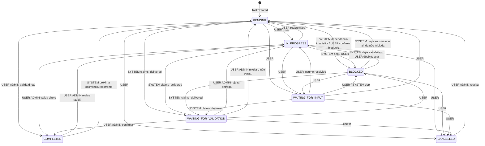
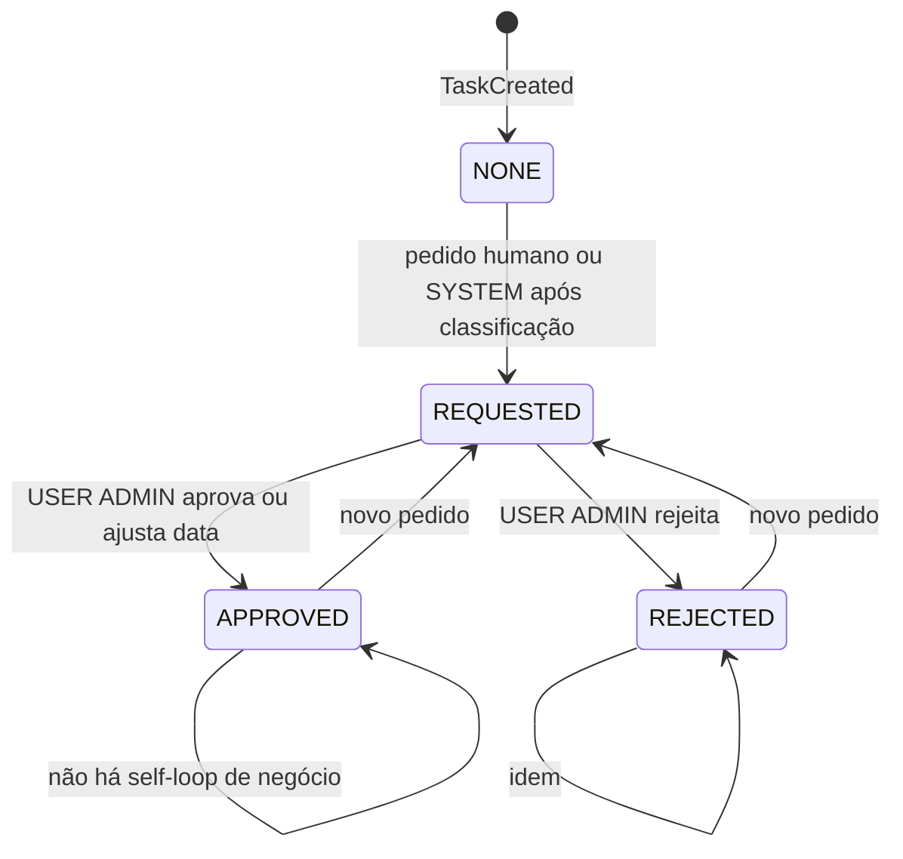
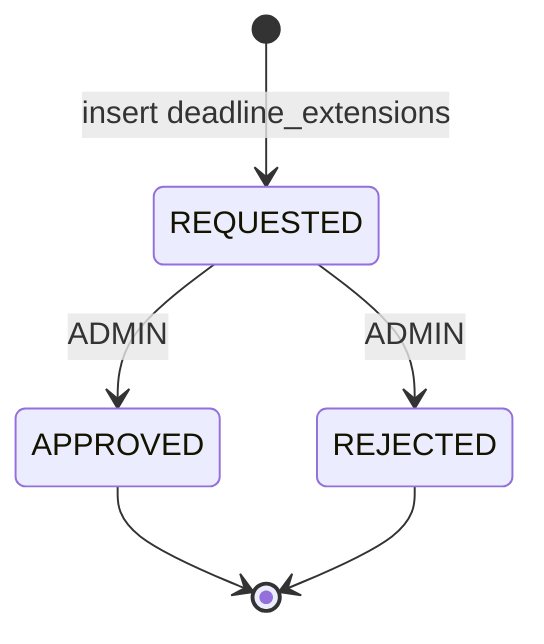

# 03 — Máquinas de estado

**Projeto:** Matriz de Responsabilidade  
**Fase:** 0 (especificação)  
**Complementa:** `02-domain-model.md`, `04-deadline-engine.md`

Três eixos **ortogonais**. Não colapsar em um único enum. Uma tarefa pode estar `IN_PROGRESS + OVERDUE` ou `BLOCKED + ON_TIME` (seção 7, I4).

| Eixo | Persistido? | Fonte de verdade |
|---|---|---|
| Operacional (`base_status`) | Sim, `tasks.base_status` | transições desta máquina |
| Prorrogação (`extension_status`) | Sim, `tasks.extension_status` + `deadline_extensions` | última extensão |
| Prazo calculado | **Não** (cache opcional) | `DeadlineEngine.compute(task, today)` |

Toda transição operacional gera `task_status_history` + `audit_logs`.  
Ator (`actor_type`): `USER` | `AUTOMATION` | `WHATSAPP` | `AI_SUGGESTION` | `SYSTEM`.

---

## 1. Atores — o que cada um pode fazer

| Ator | Significado | Pode mutar `base_status`? | Pode mutar prazo vigente? |
|---|---|---|---|
| `USER` | Operador autenticado (ADMIN / OPERATOR) | Sim, conforme papel | Sim, via edição de regra ou aprovação de prorrogação (ADMIN) |
| `SYSTEM` | Regra determinística em `packages/core` | Sim, só transições listadas como SYSTEM | Sim, só cálculo de motor / fechar ocorrência |
| `AUTOMATION` | Worker/scheduler (pg-boss) | **Não** diretamente — enfileira; o domínio aplica como SYSTEM | Não; dispara recálculo SYSTEM |
| `WHATSAPP` | Origem da mensagem inbound | **Não** sozinho | Não |
| `AI_SUGGESTION` | Classificação + sugestão persistidas | **Não. Nunca.** (A15, seção 3 e 47) | **Não. Nunca.** |

`AUTOMATION` e `WHATSAPP` aparecem em `audit_logs.origin` para rastreio (“lembrete enviado”, “resposta recebida”). A **escrita** do status da tarefa, quando automática e determinística, é gravada como `SYSTEM` com `origin=WHATSAPP|WORKER` e `correlation_id`.

### 1.1 O que é proibido à IA

A IA **não é ator de domínio**. Ela só insere `ai_classifications` e pode **originar** `inbox_items`. É proibido:

- prorrogue prazo (`ExtensionApproved` / `current_due_date`)
- alterar responsável (`task_responsibles`)
- marcar `COMPLETED` (mesmo se a mensagem for “já entreguei”)
- excluir tarefa
- alterar dependências
- aprovar justificativa
- negociar nova data em nome do admin
- enviar comunicação a sócios
- executar alteração irreversível
- calcular prazo ou decidir `OVERDUE` (seção 47)
- escrever `tasks.base_status` diretamente

Mesmo com `confidence = 1.0`, a classificação é insumo. Políticas SYSTEM abaixo são **código determinístico** sobre o enum já validado por Zod — não “a IA decidiu o status”.

### 1.2 Política SYSTEM permitida (conservadora)

| Classificação validada | Condição | Efeito SYSTEM | Senão |
|---|---|---|---|
| `CLAIMS_DELIVERED` | confidence ≥ threshold **e** `task_id` identificado **e** status ∉ {`COMPLETED`,`CANCELLED`,`WAITING_FOR_VALIDATION`} | `→ WAITING_FOR_VALIDATION` + inbox `DELIVERY_CLAIM` | só inbox (ou `UNCLEAR`) |
| `EXTENSION_REQUEST` | sempre que extração passar no schema | `ExtensionRequested` (linha `REQUESTED`) + inbox. **Due date intacta** | — |
| `BLOCKED` / `NEEDS_ANOTHER_PERSON` | | **só inbox** no MVP; admin aplica `BLOCKED` se concordar | evita falso bloqueio |
| `UNCLEAR` / abaixo do threshold | | inbox `UNCLEAR_REPLY`; `requires_human_action=true`; **zero** mutação de tarefa | — |

**D7 / Q5:** um responsável dizer “entreguei” abre validação da **tarefa inteira** (a demanda é una). Não há status por responsável no MVP.

Bloqueio por **grafo de dependência** (pré-requisito não `COMPLETED`) é SYSTEM **independente** de IA: determinístico e obrigatório.

---

## 2. Máquina OPERACIONAL

Estados persistidos em `tasks.base_status`:

| Estado | Significado para o operador |
|---|---|
| `PENDING` | Cadastrada, ainda não iniciada. Inclui “próximo período” de recorrência recém-aberto |
| `IN_PROGRESS` | Em andamento |
| `BLOCKED` | Impedida (dependência não satisfeita **ou** bloqueio declarado e confirmado) |
| `WAITING_FOR_INPUT` | Falta informação/insumo para a **tarefa** avançar (eixo da demanda, não da inbox) |
| `WAITING_FOR_VALIDATION` | Responsável afirmou entrega; admin ainda não confirmou |
| `COMPLETED` | Entrega **validada** por ADMIN. Ação de negócio forte |
| `CANCELLED` | Descartada; não cobra, não vence |

`WAITING_FOR_INPUT` (tarefa) ≠ item aberto na Caixa de Entrada (admin). Podem coexistir (I9).

### 2.1 Diagrama



### 2.2 Tabela de transições permitidas

Legenda de ator: quem **pode originar** a transição. `USER*` = ADMIN para efeitos irreversíveis; OPERATOR pode criar/iniciar conforme Q1 (não travar FASE 0: **COMPLETED, CANCELLED, reabrir, aprovar entrega = ADMIN**).

| De | Para | Ator | Condição / efeito |
|---|---|---|---|
| — | `PENDING` | `USER` / `SYSTEM` | create; ou abertura do próximo período recorrente |
| `PENDING` | `IN_PROGRESS` | `USER` | início explícito |
| `PENDING` | `BLOCKED` | `SYSTEM` | existe dep com `satisfied_at IS NULL` |
| `PENDING` | `BLOCKED` | `USER` | bloqueio operacional confirmado |
| `PENDING` | `WAITING_FOR_INPUT` | `USER` | falta dado |
| `PENDING` | `WAITING_FOR_VALIDATION` | `SYSTEM` | política `CLAIMS_DELIVERED` |
| `PENDING` | `COMPLETED` | `USER` ADMIN | validação sem claim prévio (admin viu a entrega) |
| `PENDING` | `CANCELLED` | `USER` ADMIN | |
| `IN_PROGRESS` | `BLOCKED` | `SYSTEM` / `USER` | |
| `IN_PROGRESS` | `WAITING_FOR_INPUT` | `USER` | |
| `IN_PROGRESS` | `WAITING_FOR_VALIDATION` | `SYSTEM` | `CLAIMS_DELIVERED` |
| `IN_PROGRESS` | `COMPLETED` | `USER` ADMIN | atalho do admin; **nunca** IA/WhatsApp |
| `IN_PROGRESS` | `CANCELLED` | `USER` ADMIN | |
| `IN_PROGRESS` | `PENDING` | `USER` ADMIN | correção |
| `BLOCKED` | `PENDING` | `SYSTEM` | todas deps `COMPLETED` e tarefa nunca iniciada |
| `BLOCKED` | `IN_PROGRESS` | `SYSTEM` / `USER` | deps satisfeitas ou desbloqueio manual |
| `BLOCKED` | `WAITING_FOR_VALIDATION` | `SYSTEM` | claim mesmo bloqueada (admin decide) |
| `BLOCKED` | `WAITING_FOR_INPUT` | `USER` | |
| `BLOCKED` | `CANCELLED` | `USER` ADMIN | |
| `WAITING_FOR_INPUT` | `IN_PROGRESS` / `PENDING` / `BLOCKED` / `WAITING_FOR_VALIDATION` / `CANCELLED` | conforme linhas análogas | |
| `WAITING_FOR_VALIDATION` | `COMPLETED` | `USER` ADMIN **somente** | dispara efeitos da §5 |
| `WAITING_FOR_VALIDATION` | `IN_PROGRESS` | `USER` ADMIN | “não está entregue” |
| `WAITING_FOR_VALIDATION` | `PENDING` | `USER` ADMIN | |
| `WAITING_FOR_VALIDATION` | `BLOCKED` | `USER` | |
| `WAITING_FOR_VALIDATION` | `CANCELLED` | `USER` ADMIN | |
| `COMPLETED` | `IN_PROGRESS` | `USER` ADMIN | reabertura excepcional; `completed_at` limpo; deps dependentes podem voltar a insatisfeitas |
| `COMPLETED` | `PENDING` | `SYSTEM` | **só recorrência**: fecha ocorrência e reabre série (D2) |
| `CANCELLED` | `PENDING` | `USER` ADMIN | reativa; `cancelled_at` limpo |

Qualquer outra seta é **proibida** e deve falhar em teste de state machine (seção 43).

### 2.3 Transições explicitamente proibidas

| Transição | Por quê |
|---|---|
| `* → COMPLETED` por IA, WhatsApp, AUTOMATION | Seção 3, 19, A14, A15 |
| `WAITING_FOR_VALIDATION` pulado porque a mensagem disse “já fiz” | Sempre passar pelo estado de validação quando a origem é o responsável |
| `COMPLETED → COMPLETED` silencioso | Idempotente no use case, mas não gera segundo `TaskCompleted` |
| Sair de `CANCELLED` sem ADMIN | Evita reativação acidental do worker |
| `SYSTEM` marcar `COMPLETED` | Nem no trigger de recorrência: o SYSTEM só reabre série **depois** do ADMIN ter validado o período |

### 2.4 “Já entreguei” → `WAITING_FOR_VALIDATION`, nunca `COMPLETED` direto

Caso G / seção 19 / A14.

1. Webhook persistido (`messages`).
2. IA (ou fallback humano) classifica `CLAIMS_DELIVERED`.
3. **SYSTEM** (não a IA) aplica `base_status = WAITING_FOR_VALIDATION` se a política da §1.2 passar.
4. Inbox: “{Responsável} informou que concluiu a demanda #{n}. Confirmar entrega?”
5. Admin **confirma** → `COMPLETED` + `TaskDeliveryValidated`.
6. Admin **rejeita** → volta `IN_PROGRESS` ou `PENDING`; inbox resolvida.

Se a confiança for baixa: passo 3 **não** ocorre; só inbox `UNCLEAR_REPLY`.

Admin que já viu o artefato pode ir de `IN_PROGRESS`/`PENDING` → `COMPLETED` sem passar por `WAITING_FOR_VALIDATION`. Isso é atalho **humano**, não do responsável.

---

## 3. Máquina de PRORROGAÇÃO

Persistida em `tasks.extension_status` (projeção) e em cada linha de `deadline_extensions.status`.

Estados da **tarefa** (projeção da última extensão, ou `NONE`):

| Estado | Significado |
|---|---|
| `NONE` | Nunca houve pedido, ou ainda não existe linha |
| `REQUESTED` | Existe extensão aberta aguardando admin |
| `APPROVED` | Última extensão foi aprovada; prazo vigente já atualizado |
| `REJECTED` | Último pedido foi recusado; prazo vigente **inalterado** |

Novo pedido sempre cria **nova linha** `REQUESTED`, mesmo após `APPROVED`/`REJECTED`. `extension_count` **não** incrementa em request nem em reject — só em `APPROVED`.

### 3.1 Diagrama



A linha da extensão em si é linear e terminal:



Não existe `REQUESTED → NONE`. Não existe aprovação pela IA. Não existe `APPROVED` sem `approved_due_date` e `approved_by`.

### 3.2 Transições e efeitos

| De (projeção) | Para | Ator | Efeito |
|---|---|---|---|
| `NONE` / `APPROVED` / `REJECTED` | `REQUESTED` | `USER` ou `SYSTEM` (origem WhatsApp) | insert extensão; inbox; **não** muda `current_due_date`; evento `ExtensionRequested` |
| `REQUESTED` | `APPROVED` | `USER` ADMIN | `previous_due_date` já estava; grava `approved_due_date` (pedido ou ajustado); `current_due_date ← approved`; `original_due_date` intacto; `extension_count++`; audit; outbox `NOTIFY_PARTNERS`; recálculo de automações de lembrete; `ExtensionApproved` |
| `REQUESTED` | `REJECTED` | `USER` ADMIN | due date intacto; `ExtensionRejected`; inbox resolvida |

Invariant: ≤ 1 linha `REQUESTED` por `task_id`. Segundo pedido enquanto aberto: anexa motivo na mesma linha ou rejeita na UI (“já existe pedido em análise”) — **D9:** preferir **uma** fila: não empilhar requests paralelos.

IA pode preencher `requested_due_date` e `reason` **sugeridos**; o insert formal copia esses campos já validados, ainda assim sem aplicar a data.

---

## 4. Máquina de PRAZO CALCULADO

**Não** é coluna-fonte. O prompt listava `COMPLETED` neste eixo — **substituído por `NOT_APPLICABLE`** (I4) para não colidir com o operacional `COMPLETED`.

Estados:

| Estado | Quando |
|---|---|
| `WAITING_FOR_TRIGGER` | A regra existe mas a data ainda não materializou: `BUSINESS_DAYS_AFTER_DEPENDENCY` (e futuro `CALENDAR_DAYS_AFTER_TRIGGER`) com gatilho não `COMPLETED` validado. Também: âncora ausente |
| `ON_TIME` | Há `current_due_date`; `today < due_soon_start`; `today < due` |
| `DUE_SOON` | `today` está na janela configurável (default **3 dias úteis** antes, A2/seção 16) e `today < due` |
| `DUE_TODAY` | `today = current_due_date` no timezone da regra |
| `OVERDUE` | `today > current_due_date` |
| `NOT_APPLICABLE` | Operacional `COMPLETED` ou `CANCELLED`; **ou** tipo `MANUAL` sem data; **ou** série recorrente encerrada sem ocorrência aberta |

Comparação é **date-only** no timezone da regra (`America/Sao_Paulo` default). Não usar relógio UTC “cru” para virar o dia.

`DUE_SOON` usa dias **úteis** do mesmo `business_calendars` da regra, não calendário corrido, alinhado ao default D-3.

### 4.1 Diagrama (derivado — transições são do calendário, não do usuário)

```mermaid
stateDiagram-v2
  [*] --> WAITING_FOR_TRIGGER: regra relativa sem âncora
  [*] --> ON_TIME: data materializada no futuro
  [*] --> NOT_APPLICABLE: MANUAL sem data / COMPLETED / CANCELLED

  WAITING_FOR_TRIGGER --> ON_TIME: gatilho COMPLETED validado e due futuro
  WAITING_FOR_TRIGGER --> DUE_TODAY: gatilho materializa due = hoje
  WAITING_FOR_TRIGGER --> OVERDUE: gatilho materializa due já passado (atraso herdado)
  WAITING_FOR_TRIGGER --> NOT_APPLICABLE: tarefa cancelada

  ON_TIME --> DUE_SOON: today entra na janela D-N
  DUE_SOON --> DUE_TODAY: today = due
  DUE_TODAY --> OVERDUE: today > due
  ON_TIME --> DUE_TODAY: janela D-N não se aplica (due amanhã com N=3 ainda ON_TIME; due hoje)

  ON_TIME --> NOT_APPLICABLE: COMPLETED ou CANCELLED
  DUE_SOON --> NOT_APPLICABLE: COMPLETED ou CANCELLED
  DUE_TODAY --> NOT_APPLICABLE: COMPLETED ou CANCELLED
  OVERDUE --> NOT_APPLICABLE: COMPLETED ou CANCELLED

  OVERDUE --> ON_TIME: ExtensionApproved para data futura
  OVERDUE --> DUE_TODAY: ExtensionApproved para hoje
  DUE_TODAY --> ON_TIME: prorrogação futura
  DUE_SOON --> ON_TIME: prorrogação empurra para além da janela

  NOT_APPLICABLE --> ON_TIME: ADMIN reabre ou nova ocorrência recorrente
```



Ninguém “clica” `OVERDUE`. Worker diário e leitura da UI chamam o motor. Cache `tasks.cached_deadline_status` é hint; se `deadline_status_as_of <> today`, recomputar (D6).

### 4.2 Prioridade de avaliação (pseudocódigo)

```
se base_status ∈ {COMPLETED, CANCELLED}:
    return NOT_APPLICABLE
se current_due_date is NULL:
    se waiting_for_trigger: return WAITING_FOR_TRIGGER
    senão: return NOT_APPLICABLE
se today > due: return OVERDUE
se today == due: return DUE_TODAY
se today >= addBusinessDays(due, -N, calendar): return DUE_SOON
return ON_TIME
```

`COMPLETED` operacional **vence** overdue: tarefa entregue e validada não aparece como atrasada no dashboard (card “atrasadas” filtra operacional ativo).

---

## 5. Como os eixos coexistem

O produto **exibe os dois** (e o terceiro de prorrogação). Exemplos canônicos da seção 7:

| Operacional | Prazo | Prorrogação | Leitura humana (Observações projetadas) |
|---|---|---|---|
| `IN_PROGRESS` | `OVERDUE` | `NONE` | “Em andamento. Atrasada há N dias.” |
| `BLOCKED` | `ON_TIME` | `NONE` | “Bloqueada por demanda #2. No prazo.” |
| `BLOCKED` | `OVERDUE` | `NONE` | “Bloqueada. Prazo já passou — **não cobrar o responsável como se pudesse entregar**” (A26). Inbox para o admin |
| `WAITING_FOR_TRIGGER` n/a — isso é prazo, não operacional. Operacional tipicamente `PENDING` ou `BLOCKED` | `WAITING_FOR_TRIGGER` | `NONE` | “Aguardando conclusão da demanda #2 para iniciar a contagem do prazo.” |
| `WAITING_FOR_VALIDATION` | `DUE_TODAY` | `NONE` | “Entrega informada, aguardando sua validação. Vence hoje.” |
| `IN_PROGRESS` | `OVERDUE` | `REQUESTED` | “Em andamento. Atrasada. Prorrogação solicitada — prazo **ainda não** mudou.” |
| `IN_PROGRESS` | `ON_TIME` | `APPROVED` | “Em andamento. Prorrogado N vezes. Novo prazo: …” |
| `COMPLETED` | `NOT_APPLICABLE` | `APPROVED` | “Entregue em dd/mm/aaaa.” Sem overdue |

**A26 — não lembrar / não cobrar:**

- `COMPLETED` / `CANCELLED` → não dispara lembrete
- `WAITING_FOR_TRIGGER` → não dispara cobrança de prazo
- `BLOCKED` por dependência → não tratar como atraso **do responsável**; follow-up gentil opcional + inbox admin
- `REQUESTED` não silencia overdue visual, mas o copy de WhatsApp deve mencionar que há pedido em análise se o admin quiser (não automático no MVP)

Dashboard: cards “atrasadas” = operacional **não** terminal **e** prazo `OVERDUE`. “Bloqueadas” = `BLOCKED` independentemente do prazo.

---

## 6. Efeito de `COMPLETED` validado

Somente após transição **USER ADMIN** → `COMPLETED` (ou, em recorrência, validação que fecha a ocorrência — o ADMIN continua sendo quem valida).

Eventos (nesta ordem, mesma transação de domínio + outbox):

1. **`TaskDeliveryValidated`** / **`TaskCompleted`**
   - `completed_at = now()` (série não recorrente)
   - `task_status_history`, `audit_logs`
   - inbox `DELIVERY_CLAIM` relacionada → `RESOLVED`
2. **Dependentes — `TaskDependencySatisfied`**
   - para cada `task_dependencies` com `depends_on_task_id = this` e `satisfied_at IS NULL`: setar `satisfied_at`
   - se o dependente tinha **todas** as arestas satisfeitas (AND) e `base_status = BLOCKED` com motivo de dependência: `SYSTEM` → `PENDING` ou `IN_PROGRESS` (se já havia sido iniciada antes do bloqueio: preferir `IN_PROGRESS`; senão `PENDING`)
3. **Recálculo de prazos relativos**
   - para cada dependente cuja regra é `BUSINESS_DAYS_AFTER_DEPENDENCY` (ou `CALENDAR_DAYS_AFTER_TRIGGER`) **e** `trigger_task_id = this`:
     - materializar `due = addN(completion_date, amount, calendar)` (ver `04`)
     - preencher `original_due_date` se ainda nulo
     - atualizar `current_due_date` e `explanation`
     - `waiting_for_trigger = false`
     - prazo `WAITING_FOR_TRIGGER` → `ON_TIME` / `DUE_*` / `OVERDUE`
   - **não** recalcular `FIXED_DATE` de ninguém (I3, A28)
   - **não** recalcular relativos cujo `trigger_task_id` é **outra** tarefa
4. **Próxima ocorrência recorrente**
   - se `deadline_type = RECURRING_BUSINESS_DAY` e série ativa:
     - ocorrência `OPEN` → `COMPLETED` (`completed_by` = admin)
     - **não** persistir `tasks.completed_at`
     - criar próxima ocorrência; `current_due_date` ← novo due
     - `SYSTEM`: `base_status → PENDING` (Q3 / A16)
     - cache de prazo da nova data
5. **Outbox**
   - cancelar `notification_events` SCHEDULED desta tarefa (série não recorrente)
   - na recorrência, reagendar para o novo due
   - não enviar “parabéns, concluído” ao responsável no MVP (reduz ruído)

Reabrir `COMPLETED` (ADMIN): `satisfied_at` dos dependentes **não** é apagado automaticamente se o dependente já correu prazo — **D10:** reabertura é excepcional; o admin deve ser avisado de que dependentes já desbloqueados **não** serão re-bloqueados sem ação explícita. Evita efeito cascata surpresa. Registrar a limitação em audit.

---

## 7. Origens × auditoria

| Ação | `actor_type` gravado | `origin` |
|---|---|---|
| Admin muda status na UI | `USER` | `WEB_UI` |
| Claim “já entreguei” aplica `WAITING_FOR_VALIDATION` | `SYSTEM` | `WHATSAPP` |
| IA só classificou | — (não há linha de status) | classificação em `ai_classifications` |
| Admin confirma entrega sugerida pela inbox | `USER` | `WEB_UI` + `inbox_item_id`; **não** marcar `AI_SUGGESTION` como quem completou |
| Admin clica “aplicar sugestão de status BLOCKED” | `USER` com nota `AI_SUGGESTION` no audit `before/after` / `reason` | a mutação é humana |
| Worker detecta overdue e gera notificação | `AUTOMATION` no `notification_events`; tarefa **não** muda `base_status` | `WORKER` |
| Dependência satisfeita desbloqueia | `SYSTEM` | `WORKER` / in-process |

Nunca atribuir `COMPLETED` a `AI_SUGGESTION`.

---

## 8. Observações da matriz (projeção, não estado)

A27: a célula “Observações” **lê** as três máquinas + notas:

- `Pendente` / `Em andamento` / `Bloqueada` / `Aguardando validação` / `Entregue em …` / `Cancelada`
- prazo: `No prazo` / `Vence hoje` / `Atrasada há N dias` / `Aguardando gatilho`
- `Prorrogado N vezes. Novo prazo: …` / `Prorrogação solicitada por {nome}`
- última `task_notes` (se houver)

Não existe `tasks.observations_text` como fonte da lógica.

---

## 9. Testes obrigatórios da máquina (seção 43)

1. Grafo de transições: cada seta da §2.2 aceita; cada seta da §2.3 rejeita.
2. `CLAIMS_DELIVERED` → `WAITING_FOR_VALIDATION`, nunca `COMPLETED`.
3. IA não consegue chamar o use case `completeTask`.
4. `BLOCKED + ON_TIME` e `IN_PROGRESS + OVERDUE` serializam e recompõem.
5. `COMPLETED` validado satisfaz AND de múltiplos pré-requisitos só quando **todos** estão complete.
6. `FIXED_DATE` do vizinho não muda no passo 3 da §6.
7. Recorrência: após validar período, `base_status=PENDING`, `completed_at` da task nulo, nova ocorrência `OPEN`.
8. Segundo `ExtensionRequested` com um já aberto é rejeitado (D9).
9. `REQUESTED` não altera `current_due_date`; `APPROVED` altera; `REJECTED` não.
10. Tarefa `COMPLETED` tem prazo `NOT_APPLICABLE` mesmo se `current_due_date` no passado.

---

## 10. Assumptions locais

| ID | Decisão |
|---|---|
| D9 | No máximo um pedido de prorrogação `REQUESTED` por tarefa. |
| D10 | Reabrir `COMPLETED` não re-bloqueia dependentes automaticamente. |
| D11 | `COMPLETED` direto pelo ADMIN a partir de `PENDING`/`IN_PROGRESS` é permitido (atalho humano). |
| D12 | Bloqueio detectado só pela IA **não** muda `base_status` no MVP (só inbox). Bloqueio por grafo **sim**. |
