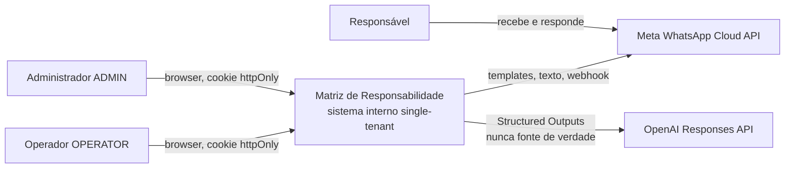
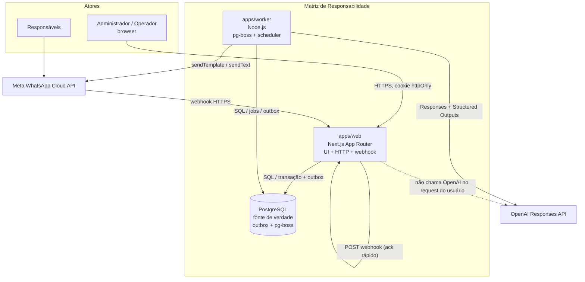
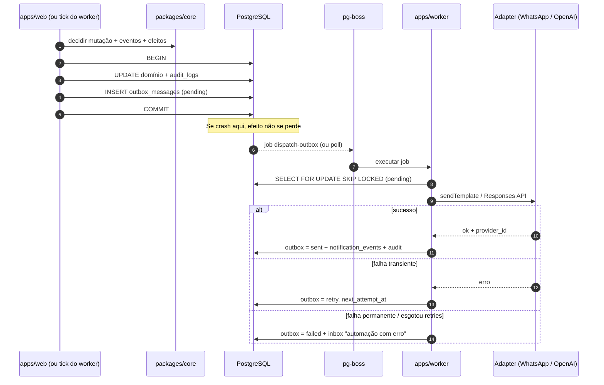

# 05 — Arquitetura

Status: FASE 0 — especificação (sem código de produção).
Idioma: português do Brasil.
Escopo: sistema interno single-tenant (A1). Sem Kubernetes, sem microservices, sem Redis no MVP.

Este documento descreve a arquitetura C4 (níveis 1–2), os boundaries do monorepo, o fluxo HTTP versus worker, a separação EVENTO ≠ EFEITO, os vertical slices das fases 1–7, autenticação, configuração, observabilidade, fallbacks e o essencial de infra. O detalhamento de Compose, backups e runbooks cabe ao DevOps (`docs/runbooks/` e Compose). ADRs relacionados: ADR-001 a ADR-006.

---

## 1. Propósito

Substituir matrizes em Word por uma aplicação interna confiável, simples de operar e evolutiva. O sistema reduz o trabalho operacional do administrador (criar matriz, cadastrar demanda, indicar responsável/prazo/dependências, acompanhar exceções) e **não** transfere decisões sensíveis para um chatbot autônomo.

A arquitetura existe para garantir:

- uma única fonte de verdade (PostgreSQL);
- regras de domínio em um só lugar (`packages/core`);
- efeitos colaterais confiáveis (outbox transacional + pg-boss);
- human-in-the-loop para qualquer mutação de prazo, status definitivo, responsável ou comunicação sensível;
- operação local reproduzível (`docker compose up`) e produção futura **independente** da máquina do desenvolvedor.

---

## 2. Princípios (não negociáveis)

1. Banco de dados é a fonte de verdade. IA não é (PROMPT §37, A8, A15).
2. EVENTO de domínio ≠ EFEITO colateral (PROMPT §29–30, A23).
3. Não chamar API externa dentro da transação crítica (outbox).
4. Worker separado da UI. Sem duplicar regra de negócio (PROMPT §28).
5. Sem microservices, Kubernetes ou Redis no MVP (PROMPT §47, A6).
6. WhatsApp apenas via API oficial (ADR-003). Sem unofficial.
7. IA nunca muta domínio. Só classifica, sugere e abre inbox (ADR-004, ADR-006).
8. Se IA, WhatsApp ou worker caírem, dados e prazos continuam corretos e auditáveis (A32).
9. Código/schema em inglês; UI em português (A3).
10. Spec → domínio → arquitetura → ADR → critério de aceite → testes → slice vertical (PROMPT §42).

---

## 3. Critério de qualidade (PROMPT §50) — respostas explícitas

Cada pergunta da seção 50 responde **SIM**. Se no futuro alguma resposta virar NÃO, a solução deve ser revista antes de implementar.

| Pergunta | Resposta | Como a arquitetura garante |
|---|---|---|
| Isso reduz trabalho operacional real? | **SIM** | Scheduler + outbox enviam lembretes, classificam respostas e abrem a inbox. O admin só intervém em exceções (PROMPT §2–3). |
| Isso é auditável? | **SIM** | Toda mutação gera `audit_logs` (quem, quando, anterior, novo, origem: USER / AUTOMATION / WHATSAPP / AI_SUGGESTION / SYSTEM). Eventos e efeitos ficam persistidos. |
| Isso evita uma ação indevida da IA? | **SIM** | IA não tem porta de escrita no domínio. Ações proibidas (PROMPT §3) exigem confirmação humana (ADR-004). |
| Isso funciona se a IA cair? | **SIM** | Mensagem já persistida; classificação fica pendente; item de inbox; prazos e dados intactos (ADR-006, §12). |
| Isso funciona se o WhatsApp estiver indisponível? | **SIM** | Outbox retenta; UI, prazos e inbox continuam; fallback in-app e mensagem para copiar (A24, §12). |
| Isso consegue explicar por que determinado prazo foi calculado? | **SIM** | `DeadlineRule` estruturada + `original_due_date` + motor em `packages/core` (determinístico, sem IA) + audit da regra. |
| Isso consegue explicar por que determinada mensagem foi enviada? | **SIM** | `notification_events` + regra aplicada + `correlation_id` + outbox (payload, tentativas, resultado). |
| Isso suporta múltiplos responsáveis? | **SIM** | N:N em `task_responsibles`; notificação por destinatário; digest por pessoa; sem responsável primário no MVP (A20). |
| Isso suporta dependências? | **SIM** | `task_dependencies` explícitas; ciclo e auto-dependência proibidos em `packages/core`; AND de pré-requisitos (A12). |
| Isso suporta prorrogações históricas? | **SIM** | Entidade `DeadlineExtension` com prazos anterior/novo, motivo, status e audit; prazo original preservado (A28). |
| Isso pode ser executado e testado localmente? | **SIM** | `docker compose up` sobe postgres, web e worker. Testes (Vitest/Playwright) contra o mesmo Compose. Túnel WhatsApp é perfil separado (ADR-001). |

---

## 4. Contexto C4 — nível 1 (sistema)

O sistema **Matriz de Responsabilidade** é uma aplicação web interna. Pessoas internas usam o browser. Responsáveis externos **não** têm login: interagem só pelo WhatsApp, quando houver opt-in e template autorizado.



Atores e sistemas externos:

| Ator / sistema | Papel | Dentro do MVP? |
|---|---|---|
| Administrador (`ADMIN`) | Dono. Únicas ações irreversíveis/sensíveis. | Sim (A9). Primeiro usuário = admin dono. |
| Operador (`OPERATOR`) | Cadastro e leitura operacional. | Modelo no dia 1; quantidade real depende de Q1. |
| Responsável | Entidade de domínio; canal WhatsApp. Sem login. | Sim. |
| Sócios (NotificationTargets) | Destinatários de prorrogação aprovada. | Configurável (A30). Seed concreto é Q4. |
| Meta Cloud API | Único provedor WhatsApp do MVP. | Sim (ADR-003). Conta WABA é Q2. |
| OpenAI | Triagem opcional. | Sim, com fallback (ADR-006). |
| E-mail | Fora do MVP. | Preparado no `NotificationTarget` (`EMAIL`). |

Não há outros bounded contexts no MVP. Single-tenant: um workspace, um banco, um Compose.

---

## 5. Containers C4 — nível 2

Três processos nossos + um banco. APIs externas ficam fora do runtime.



| Container | Tecnologia | Responsabilidade | Não faz |
|---|---|---|---|
| `apps/web` | Next.js (App Router), React, Tailwind, shadcn/ui, TanStack Table | UI desktop-first, Server Actions / Route Handlers, autenticação, **receber** webhook da Meta, persistir bruto + gravar outbox, composição de casos de uso | Calcular prazo, detectar ciclo, decidir lembrete, chamar OpenAI, enviar WhatsApp de forma síncrona na transação |
| `apps/worker` | Node.js + pg-boss | Poll da outbox, envio WhatsApp, classificação IA, scheduler de prazos, digest, retries | Renderizar UI, autenticar browser, duplicar regra de domínio |
| PostgreSQL | 16.x (versão estável do Compose) | Dados, migrations Drizzle, filas pg-boss, outbox, audit | — |
| Meta Cloud API | SaaS | Transporte WhatsApp | Regra de negócio |
| OpenAI | SaaS | Classificação estruturada | Fonte de verdade, cálculo de prazo, mutação |

O webhook entra no `web` porque já há HTTP. O `web` **não processa** a mensagem: persiste o payload, garante idempotência e devolve 200. O `worker` classifica e abre inbox.

Comunicação interna: **não** há broker (Rabbit, Kafka, Redis). Web e worker compartilham PostgreSQL. Contratos são tipos TypeScript em `packages/shared` e eventos/efeitos em `packages/core`.

---

## 6. Monorepo e boundaries

```
/apps
  /web          composição HTTP + UI
  /worker       composição de jobs
/packages
  /core         ÚNICO lugar de regra de domínio
  /db           Drizzle schema, migrations, repositórios
  /whatsapp     WhatsAppProvider + MetaWhatsAppProvider
  /ai           cliente OpenAI, schemas Zod, prompts versionados
  /config       validação de ENV (Zod) — fail-fast na subida
  /shared       tipos, logger Pino, correlation_id, máscara de telefone
/docs
  /specs
  /adr
  /runbooks
```

### 6.1 O que vive em cada package

| Package | Contém | Proibido |
|---|---|---|
| `core` | Motor de prazo, calendário útil, grafo de dependências (ciclo/auto), transições de status, política anti-spam de notificação, catálogo de eventos e efeitos, invariantes (A10–A29) | I/O, Drizzle, `fetch`, OpenAI, Meta, React |
| `db` | Schema, migrations versionadas, queries, mapeamento persistido ↔ domínio | Regra (ex.: “está atrasado?”, “pode depender de si?”) |
| `whatsapp` | Interface `WhatsAppProvider` (`sendTemplate`, `sendText`, `receiveWebhook`, `getMessageStatus`), adapter Meta, verificação de assinatura | Decidir **se** envia; templates de negócio “quando lembrar” |
| `ai` | Chamada Responses API, Structured Outputs, parse Zod, versão de prompt, threshold de confidence | Mutar Task/Deadline; calcular prazo; marcar COMPLETED |
| `config` | Schema Zod das ENV, tipos `AppConfig` | Defaults mágicos de negócio (D-3 fica em `notification_rules`) |
| `shared` | `correlation_id`, Pino factory, `maskPhone`, branded types (`E164`) | Domínio |

### 6.2 Regra de dependência

```
apps/web  ──► core, db, config, shared, whatsapp (só verify + persistência bruta)
apps/worker ──► core, db, config, shared, whatsapp, ai

core     ──► shared (tipos puros, sem I/O)
db       ──► shared, core (tipos / entidades, sem ciclo de I/O)
whatsapp ──► shared, config
ai       ──► shared, config
config   ──► (nada de domínio)
```

`web` e `worker` **não** implementam `isOverdue`, `hasCycle`, `canSendReminder` ou transições de status. Se a regra aparecer nos dois, está no lugar errado: mover para `core`.

`packages/core` não importa `packages/db`. Casos de uso de aplicação (orquestração transação + outbox) ficam nos apps, chamando funções puras de `core` e repositórios de `db`. Isso evita hexagonal excessivo em sistema interno, mas preserva o boundary.

### 6.3 O que a arquitetura **não** é

- Não é malha de microservices.
- Não é event-sourcing completo (eventos são fatos internos + outbox, não rebuild do estado).
- Não é CQRS com bus separado. A visão GERAL é query agregada (A17).
- Não há Redis, Elasticsearch, Kubernetes, service mesh.

---

## 7. Fluxo de request HTTP versus worker

### 7.1 Ação humana na UI (exemplo: aprovar prorrogação)

```
Browser
  → Next.js Server Action (cookie de sessão)
  → authorize(ADMIN)                          apps/web
  → core.approveExtension(input)              packages/core (puro: novo prazo, invariantes)
  → BEGIN
       persistir DeadlineExtension APPROVED
       atualizar prazo vigente (não o original)
       audit_log origem=USER
       emitir evento in-process ExtensionApproved (não há tabela domain_events)
       INSERT outbox_messages (efeitos: RecalculateDependents, NotifyShareholders, NotifyResponsibles)
    COMMIT                                    packages/db
  → (opcional) pg-boss.send('dispatch-outbox')  se não houver poller contínuo
  → resposta HTTP 200 + UI atualizada
```

O HTTP **não** espera Meta nem OpenAI. Se o processo cair após o COMMIT, o efeito permanece na outbox.

### 7.2 Webhook WhatsApp (ack rápido)

```
Meta POST /api/webhooks/whatsapp
  → verificar assinatura (packages/whatsapp)
  → BEGIN
       INSERT messages (raw payload, provider_message_id UNIQUE)
         ON CONFLICT DO NOTHING          idempotência
       se inseriu: INSERT outbox (ClassifyInboundMessage)
    COMMIT
  → 200 OK
```

Reenvio da Meta com o mesmo `provider_message_id` não reprocessa (PROMPT §17). Processamento (normalizar, correlacionar tarefa, IA, inbox) é **sempre** no worker.

Verificação GET do webhook (challenge) é o único caminho síncrono trivial: valida token e devolve o challenge.

### 7.3 Worker (processo longo)

Loops principais, todos no mesmo `apps/worker`:

| Loop / fila pg-boss | Gatilho | Trabalho |
|---|---|---|
| `dispatch-outbox` | Nova linha outbox ou poll 1–5s | Executar efeito via adapter; registrar resultado |
| `deadline-tick` | Cron interno (ex.: a cada 15 min + meia-noite America/Sao_Paulo) | Recalcular status de prazo; emitir `TaskDueSoon` / `TaskOverdue` |
| `notification-plan` | Eventos de prazo / tick | Aplicar `notification_rules` + anti-spam + digest (core) e gravar novos efeitos |
| `classify-inbound` | Outbox `ClassifyInboundMessage` | Chamar `packages/ai`; persistir `ai_classifications`; abrir inbox **sem** mutar Task |
| `retry-failed` | Backoff da outbox | Reenviar efeitos falhos até limite; depois inbox “automação com erro” |

O worker é **stateless**. Estado está no Postgres. Pode-se subir uma réplica no futuro; no MVP, **uma instância** de worker (pg-boss com advisory lock evita double-run).

### 7.4 O que nunca acontece no request HTTP

- `fetch` para OpenAI.
- `sendTemplate` / `sendText` para a Meta **dentro** da transação da tarefa.
- Cálculo de “terceiro dia útil” reimplementado no componente React (UI só exibe o que `core` já calculou ou um endpoint de preview que chama `core`).

Preview de prazo na UI: Server Action chama `core.previewDueDate(...)` — função pura, sem I/O externo.

---

## 8. Domain events internos e EVENTO ≠ EFEITO

### 8.1 Catálogo de eventos (PROMPT §29)

Evento = fato que **já ocorreu** no domínio, persistido após COMMIT. Não é um comando. Não é uma chamada de API.

| Evento | Quando nasce | Não implica automaticamente |
|---|---|---|
| `TaskCreated` | Tarefa persistida | Envio de WhatsApp |
| `TaskUpdated` | Campos de negócio alterados | Recalcular tudo |
| `TaskCompleted` | ADMIN confirmou entrega (A14) | — (esse sim autoriza satisfazer dependências) |
| `TaskDependencySatisfied` | Pré-requisito COMPLETED e o AND fechou | Mudar FIXED_DATE (A28, I3) |
| `TaskDueSoon` | Motor de prazo no tick | Enviar lembrete (passa por regras + anti-spam) |
| `TaskOverdue` | Idem | Cobrar bloqueada como atraso (proibido, A26) |
| `ReminderScheduled` | Política de notificação aceitou o envio | Mensagem já na Meta |
| `ReminderSent` | Adapter confirmou envio (ou aceitou o POST) | Leitura pelo responsável |
| `ResponsibleResponded` | Mensagem inbound correlacionada | Classificação IA concluída |
| `BlockerDetected` | Classificação BLOCKED **e/ou** humano marcou | Mutação automática de prazo |
| `ExtensionRequested` | IA ou humano abriu pedido | Prazo alterado |
| `ExtensionApproved` | ADMIN aprovou/ajustou | — (aí sim atualiza prazo vigente) |
| `ExtensionRejected` | ADMIN rejeitou | — |
| `TaskDeliveryClaimed` | Responsável disse “já entreguei” (IA ou humano) | `COMPLETED` |
| `TaskDeliveryValidated` | ADMIN confirmou | Equivale/acompanha `TaskCompleted` |

Não adotamos message broker nem tabela `domain_events`. O evento de domínio é **emitido in-process** após as invariantes. Persistência do fato = `audit_logs` + tabelas específicas (`task_status_history`, `deadline_extensions`, `inbox_items`, …). Consumidores **não** escutam um log de eventos para chamar a Meta. Consumidores de efeito leem a **outbox**. Decisão alinhada a `docs/02-domain-model.md` (tabela `domain_events` rejeitada como redundante).

### 8.2 Catálogo de efeitos (outbox)

Efeito = trabalho de I/O ou orquestração **ainda a fazer**. Gravado na **mesma transação** do fato.

| Efeito (tipo da outbox) | Origem típica | Adapter |
|---|---|---|
| `SendWhatsAppTemplate` | `ReminderScheduled` | `packages/whatsapp` |
| `SendWhatsAppText` | Janela de atendimento aberta, resposta humana | `packages/whatsapp` |
| `NotifyAdminInApp` | Qualquer exceção | `db` (inbox) — se a inbox já foi escrita na transação, este efeito pode ser no-op |
| `NotifyAdminWhatsApp` | Resumo / pedido de prorrogação | `packages/whatsapp` |
| `NotifyShareholdersExtension` | `ExtensionApproved` | WhatsApp individual e/ou texto para copiar (A24) |
| `ClassifyInboundMessage` | `ResponsibleResponded` | `packages/ai` |
| `RecalculateDependentDeadlines` | `TaskCompleted` / `TaskDependencySatisfied` | `core` + `db` (sem API externa) |
| `PlanNotifications` | `TaskDueSoon` / `TaskOverdue` / tick | `core` (pode gerar novos `SendWhatsAppTemplate`) |
| `OpenInboxItem` | IA low-confidence, falha de envio, claim de entrega | `db` |

Inbox do admin pode ser escrita **na transação** quando o fato já é humano (ex.: ADMIN não precisa de job para ver a prorrogação que ele mesmo pediu via UI). Efeitos externos (Meta, OpenAI) **sempre** passam pela outbox.

### 8.3 Fluxo outbox → pg-boss → adapter

Outbox = persistência durável do efeito (A23, I8).
pg-boss = poller/worker sobre PostgreSQL (não é o registro do efeito).



Idempotência no adapter: chave `(provider, template, task_id, responsible_id, rule_id, occurrence_key)` em `notification_events`. Reprocessar a outbox não dispara o mesmo lembrete (PROMPT §16).

Payload conceitual da outbox (não é código de produção):

```json
{
  "id": "uuid",
  "effect_type": "SendWhatsAppTemplate",
  "aggregate_type": "Task",
  "aggregate_id": "uuid",
  "payload": {
    "template": "REMINDER_DUE_SOON",
    "responsible_id": "uuid",
    "task_id": "uuid",
    "correlation_id": "uuid"
  },
  "status": "pending",
  "attempts": 0,
  "available_at": "2026-08-27T15:00:00-03:00"
}
```

### 8.4 Exemplo concreto: EVENTO vs EFEITO

`TaskOverdue` **não** é “mandar WhatsApp”.

1. Tick persiste `TaskOverdue`.
2. `PlanNotifications` (core) consulta regras, anti-spam, bloqueio, WAITING_FOR_TRIGGER, digest (A25–A26).
3. Se permitido: persiste `ReminderScheduled` + outbox `SendWhatsAppTemplate`.
4. Worker envia. Sucesso → `ReminderSent`.
5. Se a tarefa estiver `BLOCKED`, não cobra atraso do responsável; abre inbox para o admin (A26).

---

## 9. Vertical slices alinhados às fases 1–7

Implementação vertical: cada slice entrega persistência + regra `core` + UI mínima + teste. Não “todas as telas depois a API” (PROMPT §42, §45). O DoD da seção 48 cobre até a **FASE 5**. FASE 1 sozinha **não** é o MVP completo (A33, I10).

| Fase | Slice | Entrega arquitetural | Fora |
|---|---|---|---|
| **0** | Spec | Este documento + ADRs | Código de produção |
| **1 — Core** | 1.1 Bootstrap | Compose postgres/web/worker, `packages/config`, `users` + sessão cookie, primeiro ADMIN | OAuth, WhatsApp |
| | 1.2 Matrizes | CRUD, tipo controlado (A18), `archived_at`, visão lista | — |
| | 1.3 Responsáveis | CRUD, E.164, papel texto livre (A19) | Opt-in WhatsApp real |
| | 1.4 Tarefas + tabela | `sequence_number` imutável, `display_order`, N:N responsáveis, colunas da matriz | Motor relativo |
| | 1.5 Dependências | `task_dependencies`, ciclo, AND, visual de bloqueio | Recalcular relativo |
| | 1.6 Prazo FIXED_DATE | `DeadlineRule` + `original_due_date`, tabela e dashboard básico | Dias úteis, worker de tick |
| | 1.7 Visão GERAL + dashboard | Query agregada (A17), cards de atenção | Automações WhatsApp |
| **2 — Deadline engine** | 2.1 Calendário | Holidays seed BR 2026–2028, dias úteis em `core` (TDD) | API externa de feriado |
| | 2.2 Relativos | BUSINESS_DAYS_AFTER_CREATION / AFTER_DEPENDENCY (trigger = COMPLETED, A29, I6) | Data-marco FASE 7 |
| | 2.3 Recorrência | Uma task + `deadline_occurrences` (A16, Q3) | Clonar linhas/mês |
| | 2.4 Worker tick | `TaskDueSoon` / `TaskOverdue` / `NOT_APPLICABLE` (I4), cache `computed_at` | Envio WhatsApp |
| **3 — WhatsApp** | 3.1 Provider | Interface + Meta adapter, templates, opt-in | Unofficial |
| | 3.2 Outbox de envio | Efeitos `SendWhatsApp*`, retries, `notification_events` | IA |
| | 3.3 Webhook | Assinatura, persistência bruta, idempotência, conversas | Classificação |
| **4 — AI triage** | 4.1 Structured Outputs | ENV modelo + prompt versionado, Zod, `ai_classifications` | Mutação de Task |
| | 4.2 Inbox | Caixa de pendências, correlation_id ponta a ponta | Chat livre |
| | 4.3 Resumos | In-app; WhatsApp do admin via outbox | Autonomia |
| **5 — Prorrogações** | 5.1 Workflow | Requested → approve/adjust/reject, histórico | Auto-aprovar |
| | 5.2 Sócios | NotificationTargets, fallback copiar + in-app (A24, Q4) | Dependência de grupo |
| | 5.3 Alertas admin | WhatsApp do ADMIN para exceções | — |
| **6 — Hardening** | 6.x | E2E Playwright, rate limit, backups, Sentry opcional, runbook prod | Rewrite |
| **7 — Enhancements** | 7.x | Quick capture (preview), import CSV/XLSX/DOCX, templates de matriz, analytics, `trigger_type` data-marco (I6) | Cadastro automático sem confirmação |

FASE 7 está **preparada** (portas de inbox, preview humano, `trigger_type` no modelo) e **não implementada** no MVP (A34).

---

## 10. Autenticação e autorização (A9)

MVP single-tenant, sem OAuth.

| Decisão | Detalhe |
|---|---|
| Identidade | Tabela `users` desde o dia 1 (`created_by`, audit). |
| Papéis | `ADMIN` e `OPERATOR`. Primeiro usuário provisionado = administrador dono. |
| Sessão | Cookie `httpOnly`, `SameSite=Lax`, `Secure` em produção. Token opaco persistido em `sessions` (revogação possível). Sem JWT como única fonte. |
| OAuth | Fora do MVP. |
| Responsáveis | Não autenticam. |

Autorização (mínimo):

| Ação | ADMIN | OPERATOR |
|---|---|---|
| CRUD matriz/tarefa/responsável, notas | Sim | Sim |
| Arquivar matriz | Sim | Não (assumption; Q1 pode relaxar) |
| Aprovar/rejeitar prorrogação | Sim | Não |
| Validar entrega (`COMPLETED`) | Sim | Não |
| Enviar comunicação a sócios | Sim | Não |
| Alterar NotificationTargets, feriados, regras de notificação, usuários | Sim | Não |
| Ver inbox e resolver itens | Sim | Leitura (assumption) |

Middleware do `apps/web` valida sessão em todas as rotas autenticadas. Webhook Meta usa assinatura, não cookie. Worker não expõe HTTP público no MVP.

Q1 (um ADMIN vs vários OPERATORs) **não bloqueia** o modelo: a tabela e os papéis existem. O seed inicial cria um ADMIN. OPERATORs extras são opcionais.

---

## 11. Configuração e validação de ENV

`packages/config` valida **na subida** de `web` e `worker` com Zod. Processo recusa subir se ENV obrigatória faltar. Secrets só em environment / secret do Compose — nunca no git (PROMPT §31, A35).

| Variável | Obrigatória | Uso |
|---|---|---|
| `DATABASE_URL` | Sim | Postgres |
| `SESSION_SECRET` | Sim (web) | Assinatura/derivação do cookie |
| `APP_URL` | Sim | Links na UI, cookies e templates |
| `NODE_ENV` | Sim | `development` / `production` / `test` |
| `LOG_LEVEL` | Não (default `info`) | Pino |
| `TZ` / timezone app | Não | Default `America/Sao_Paulo` (A2); override também em `system_settings` |
| `OPENAI_API_KEY` | Não | Sem chave = modo degradado (ADR-006) |
| `OPENAI_MODEL` | Não | Default configurável; **não** hardcodar modelo como regra de negócio |
| `AI_PROMPT_VERSION` | Não | Default `responsibility-triage-v1` (PROMPT §38) |
| `AI_CONFIDENCE_THRESHOLD` | Não | Abaixo → `requires_human_action` |
| `WHATSAPP_TOKEN` | Não em FASE 1 | Obrigatória a partir da FASE 3 se envio habilitado |
| `WHATSAPP_PHONE_NUMBER_ID` | Idem | — |
| `WHATSAPP_WABA_ID` | Idem | — |
| `WHATSAPP_APP_SECRET` | Idem | Assinatura do webhook |
| `WHATSAPP_VERIFY_TOKEN` | Idem | Challenge GET |
| `SENTRY_DSN` | Não | Ausente = sem Sentry (local grátis) |
| `PG_BOSS_SCHEMA` | Não | Default `pgboss` |

Flags de feature simples (`WHATSAPP_ENABLED`, `AI_ENABLED`) permitem FASE 1 sem credenciais Meta/OpenAI. Com flag off, outbox de envio/classificação não é despachada; o domínio permanece íntegro.

---

## 12. Observabilidade

| Recurso | MVP | Depois |
|---|---|---|
| Logs estruturados JSON | Pino em web e worker (`packages/shared`) | — |
| `correlation_id` | UUID gerado no webhook (ou no request UI) e copiado para mensagem → IA → inbox → notificação → outbox (A31) | Trace distribuído se um dia houver mais processos |
| Mascaramento | Telefone E.164 mascarado em logs (`+5511****1234`) | — |
| Erros de UI | Error boundaries React | — |
| Sentry | Código preparado (`SENTRY_DSN` opcional). **Não** exigir serviço pago no local | Ligar em produção se desejado |
| Métricas | Contagem de outbox failed / jobs via query SQL e card do dashboard “automações com erro” | Prometheus só se operação real exigir |

Cadeia mínima a ser rastreável (PROMPT §32):

```
webhook recebido
  → mensagem persistida
  → IA acionada (ou skipped: IA down)
  → classificação criada (ou pending)
  → alerta / inbox criado
```

Cada linha de log inclui: `correlation_id`, `event` ou `effect_type`, `task_id` quando houver, `level`, timestamp ISO.

---

## 13. Fallbacks (A32)

### 13.1 IA indisponível (PROMPT §39)

- Mensagem inbound **já está** no banco.
- Outbox `ClassifyInboundMessage` entra em retry / `failed`.
- UI: mensagem “pendente de classificação”.
- Inbox: item para o admin (texto bruto + contexto da tarefa).
- Prazos, dependências e dashboard **não** dependem da OpenAI.
- Quando a API voltar, o worker reprocessa pendências **ou** o admin classifica na mão. Os dois caminhos são válidos.

### 13.2 WhatsApp indisponível

- UI, cadastros, prazos, inbox e audit funcionam.
- Outbox retenta com backoff. Após esgotar: inbox “falha de envio”.
- Comunicação a sócios: in-app + texto pronto para copiar (A24). Não há dependência de grupo (A24).
- FASE 1 nem liga o adapter.

### 13.3 Worker indisponível

- `apps/web` continua: CRUD, tabela, dashboard (status de prazo pode ficar **stale** até o próximo tick; `computed_at` visível).
- Cálculo **on-read** em `core` permanece correto para a tela (prazo calculado não é fonte persistida — A13). O tick só materializa eventos `TaskDueSoon`/`TaskOverdue` e planeja notificações.
- Jobs acumulam no Postgres (pg-boss + outbox). Ao subir o worker, processa a fila. Nada depende da máquina do desenvolvedor em produção (ADR-001).

### 13.4 Postgres indisponível

Único ponto único de falha aceito no MVP. Sem banco não há sistema — e isso é intencional (simplicidade). Mitigação: Compose local com volume; em produção, backup (DevOps) e Postgres gerenciado opcional. Não se adiciona réplica de aplicação como substituto do banco.

---

## 14. Como rodar local

Ambiente de verdade = Docker Compose (ADR-001). Não “funciona só na minha Node global”.

```bash
docker compose up
```

Sobe no mínimo:

| Serviço | Porta típica | Função |
|---|---|---|
| `postgres` | 5432 | Dados + pg-boss |
| `web` | 3000 | UI e HTTP |
| `worker` | (sem porta pública) | Jobs |

Fluxo do desenvolvedor:

1. Copiar `.env.example` → `.env` (sem secrets reais commitados).
2. `docker compose up --build`.
3. Migrations Drizzle na subida do `web`/`worker` ou serviço `migrate` one-shot (DevOps decide o serviço; a arquitetura exige migrations versionadas antes de aceitar tráfego).
4. Seed: usuário ADMIN inicial, calendário de feriados, notification_rules default.
5. Abrir `http://localhost:3000`, login local.
6. FASE 1: **não** precisa de Meta nem OpenAI.

### 14.1 Túnel WhatsApp — perfil separado

Webhook da Meta exige HTTPS público. Isso **não** faz parte do `docker compose up` padrão.

```bash
docker compose --profile whatsapp-tunnel up
```

O perfil sobe um túnel (cloudflared ou ngrok — escolha e imagem no DevOps) apontando para `web:/api/webhooks/whatsapp`. Documentar a URL no runbook. O túnel é só desenvolvimento; **produção usa URL pública do servidor**, sem depender do laptop (ADR-001).

Testes de webhook sem Meta: fixture HTTP assinada nos testes de integração (QA).

---

## 15. Infra local / produção

Essencial apenas. Compose, backups, restore e CI são detalhe do DevOps — não se inventa cluster.

| Tópico | Local | Produção futura |
|---|---|---|
| Orquestração | Docker Compose | O mesmo modelo mental: 1× web, 1× worker, 1× Postgres (Compose em VPS **ou** PaaS equivalente). **Sem Kubernetes.** |
| Banco | Container `postgres` + volume | Postgres gerenciado (ou Compose com volume + backup) |
| Secrets | `.env` local (gitignored) | Secrets do host / do provedor. Nunca na imagem. |
| HTTPS | Túnel opcional (perfil) | Reverse proxy (Caddy/Traefik/Nginx) na frente do `web` |
| WhatsApp | Perfil `whatsapp-tunnel` | Hostname estável da API; webhook cadastrado na Meta |
| Backups | Volume local; dump manual aceitável | Dump periódico + teste de restore (runbook). Frequência = DevOps |
| Escala | 1 worker | 1 worker até a operação mostrar fila; Redis/BullMQ só então (ADR-005) |
| Observabilidade | Stdout Pino | Mesmo + Sentry opcional + retenção de logs do host |

Não há service discovery, sidecar, malha nem “ambiente staging obrigatório” no desenho do MVP. Staging, se existir, é um segundo Compose.

---

## 16. Portas futuras (não implementar agora)

| Capacidade | Encaixe arquitetural | Fase |
|---|---|---|
| Quick capture NL | `packages/ai` devolve draft; UI de preview; commit só com confirmação humana | 7 |
| Import CSV/XLSX/DOCX | Job no worker; draft no banco; confirmação | 7 |
| Template de matriz | Comando de domínio `duplicateMatrix` em `core` | 7 |
| E-mail | Novo adapter em `NotificationTarget` | 7+ |
| WhatsApp Group | Método opcional no `WhatsAppProvider`; UI já tem fallback | se a conta autorizar |
| BullMQ + Redis | Substituir transporte de job; **manter outbox no Postgres** | se escala exigir |
| OAuth / SSO | Provedor de identidade na frente de `users` | pós-MVP |
| Multi-tenant | Fora. Exigiria `workspace_id` em todas as tabelas | não planejado |

---

## 17. Riscos arquiteturais

| Risco | Impacto | Mitigação |
|---|---|---|
| Conta Meta / templates / opt-in atrasam FASE 3 (Q2) | DoD §48 itens 13–14 não fecham | FASE 1–2 independentes; provider abstrato; testes com fake provider |
| Uma instância de worker + pg-boss mal configurada | Job duplicado ou parado | Advisory lock; idempotência em `notification_events`; card de erro no dashboard |
| Outbox sem backoff / poison message | Loop de erro na Meta | Retries limitados + inbox; não reenviar indefinidamente o mesmo template |
| Correlation_id esquecido em algum caminho | Investigação cega | Checklist QA; logger recusa log de classificação sem id (lint de uso) |
| Status de prazo cacheado e tratado como fonte | Inconsistência (I4) | A13: calculado on-read; cache só com `computed_at` |
| Tentação de chamar OpenAI no Server Action | HTTP lento + perda em crash | Boundary: `packages/ai` só importado pelo worker (ESLint `no-restricted-imports` no `apps/web`) |
| Túnel local virar “produção” | Sistema cai quando o laptop fecha | ADR-001; produção com hostname próprio |
| Q5 (um “entreguei” entre N responsáveis) | Validação ambígua | Assumption: tarefa é una; um claim abre validação da tarefa toda; inbox deixa explícito quem falou |
| I6 (prazo “após data da live” ≠ COMPLETED) | Motor relativo incompleto para um caso real | Documentado; `trigger_type` reservado; FASE 7 |

Nenhum desses riscos muda as decisões A1–A36 nem os ADRs desta fase.

---

## 18. Assumptions e perguntas (não bloqueiam esta arquitetura)

Já travadas no brief: A1–A36.

Perguntas para o integrator consolidar em `docs/11-open-questions.md` (não inventar resposta definitiva):

- **Q1** — Um ADMIN ou vários OPERATORs no dia 1? Modelo de papéis existe de qualquer forma.
- **Q2** — WABA já existe ou greenfield? Adapter oficial não muda.
- **Q3** — Recorrência: ao concluir o período, volta a PENDING no próximo? Seguir A16 até confirmação.
- **Q4** — Quem entra no seed de NotificationTargets?
- **Q5** — Um “entreguei” valida a tarefa toda? Seguir A14/A20 (tarefa una) até confirmação.

---

## 19. Referências

- PROMPT.md §§3, 14, 17–18, 27–32, 37–39, 42, 45–47, 50
- ADR-001 web local-first
- ADR-002 PostgreSQL + Drizzle
- ADR-003 WhatsApp Cloud API
- ADR-004 Human-in-the-loop
- ADR-005 pg-boss + outbox
- ADR-006 IA Structured Outputs
- `docs/02-domain-model.md`, `docs/03-state-machines.md`, `docs/04-deadline-engine.md` (domínio)
- `docs/06-whatsapp-integration.md`, `docs/07-ai-triage.md` (detalhe de adapters)
- `docs/08-security.md` (ameaças, LGPD, webhook)
- `docs/10-roadmap.md` (slices e DoD)
- `docs/12-ux-spec.md` (telas)
- `docs/runbooks/local-dev.md` (contrato Compose)
- `docs/assumptions.md` (A1–A36)
